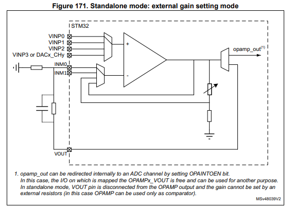

# Engine 4.2.A STM32G4外设介绍

STM32 G系列是 ST 公司中专门用于运动控制的系列 MCU，主攻工业、消费、电机控制、数字电源等主流应用市场。

> - 高性能：STM32G4基于Arm®Cortex®-M4内核，支持FPU和DSP指令集，主频高达170MHz，相较于STM32F3和STM32F1的72MHz的主频，提高了一大步。同时，STM32G4引入了新的硬件数学运算加速器 —— 数学滤波加速器（FMAC）和专用CORDIC（坐标旋转数字计算）引擎，这让STM32G4在进行电机控制的坐标旋转变换，三角函数、对数、平方根运算，以及数学滤波和数字电源控制时，更加游刃有余，为主处理器大大“减负”，提高了CPU运算效率。
> - 丰富的模拟外设：集成更丰富的模拟外设是STM32G4的一大亮点，ADC、DAC、运算放大器、比较器，应有尽有。STM32G4系列中最高配置MCU中的模拟外设多达25个。

## 1. OPAMP 运算放大器

STM32G4 内置有运算放大器。


运算放大器有三种工作模式：

> - 独立模式，外接增益调整模块
> - 电压跟随模式
> - 程控增益模式

1. 独立模式需要外接对应的电路方能正常使用，注意外围电路应当采用3.3V单电源供电设计。

   

2. 电压跟随模式即电压跟随器。

   

3. 程控增益模式可以进行2，4，8，16倍的电压增益。

   

运算放大器的输出可以直接连接 MCU 的 ADC 输入以采集电压。

```c
/**
  * @brief  启动运算放大器
  * @param  hopamp OPAMP 句柄
  */
HAL_StatusTypeDef HAL_OPAMP_Start(OPAMP_HandleTypeDef *hopamp);
```

## 2. COMP 电压比较器


比较器负端可选择配置为外部引脚输入、连接到DAC输入以及参考电压输入。


> - `Trigger Mode`：可选上升沿、下降沿或双边沿触发，产生触发中断或事件。
> -  `Hysteresis Level`：迟滞量设置，0~70mV共8个档位可以选择，主要是为了滤除信号扰动导致比较器输出不稳定。（注意：迟滞量只有在向下比较时才有效）。
> - `Blanking Source`：配置消隐源信号（TIMx），防止比较器误触发，比如电机在换相续流时可能会导致端电压迅速上升，从而使比较器误检测。
> - `Output Polarity`：配置输出是否取反。

```c
/**
  * @brief  启动电压比较器
  * @param  hcomp COMP 句柄
  */
HAL_StatusTypeDef HAL_COMP_Start(COMP_HandleTypeDef *hcomp);
```