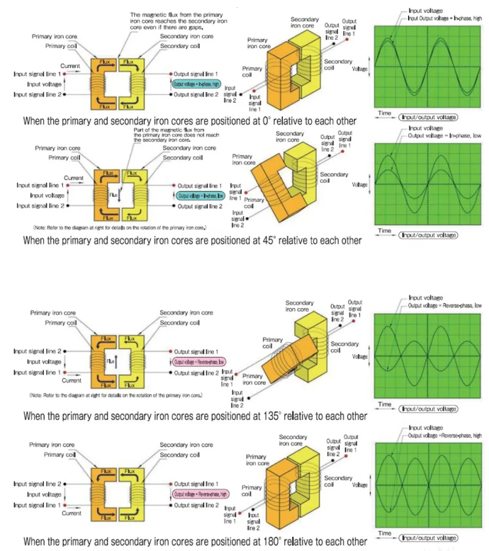
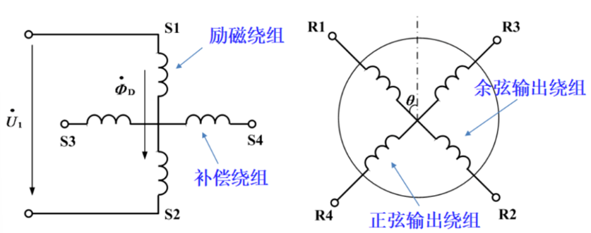
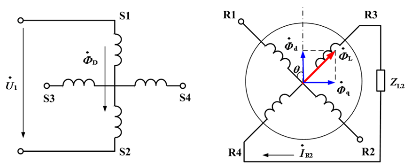
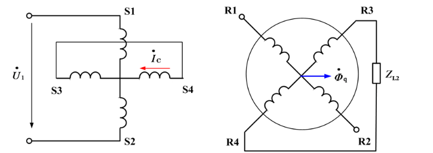
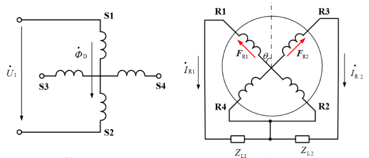
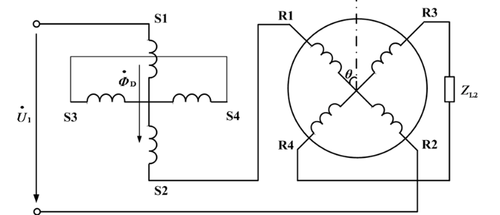
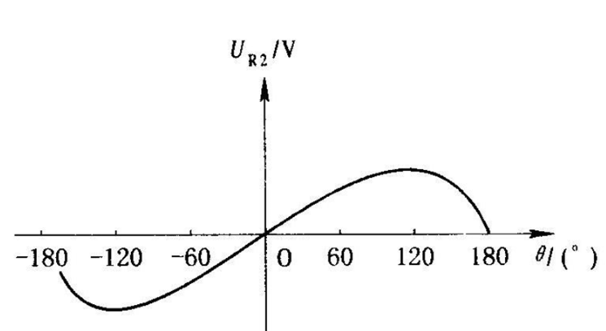
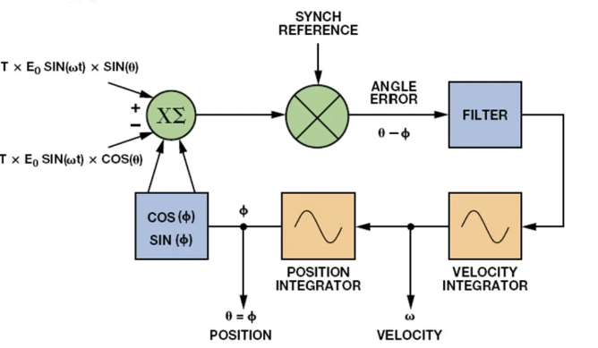

# Engine 4.2.B 旋转变压器简介

旋转变压器用于测量转子位置，其工作原理和普通变压器基本相似，区别在于普通变压器的原边、副边绕组是相对固定的，所以输出电压和输入电压之比是常数，而旋转变压器的原边、副边绕组则随转子的角位移发生相对位置的改变，因而其输出电压的大小随转子角位移而发生变化，并与之保持一定函数关系。

## 1. 旋转变压器工作原理

- 旋转变压器分为：正弦旋转变压器，线性旋转变压器，特殊旋转变压器。正弦旋转变压器输出电压与转子转角的函数关系成正弦或余弦函数关系，线性旋转变压器输出电压与转子转角成线性函数关系，常用正弦旋转变压器。

- 正弦旋转变压器

  

	在励磁绕组中加入正弦电压，可以产生脉振励磁磁场，该磁场在转子上分别感应出正弦绕组和余弦绕组的电压。
	$$
	E_{R1} = kE_1cos\theta \\
	E_{R2} = kE_2sin\theta
	$$
	旋转变压器空载时其输出电压分别是转角的余弦函数和正弦函数，这样转子绕组R1，R2就称为余弦输出绕组，而绕组R3，R4称为正弦输出绕组。
	
	接入负载后，转子电压产生畸变，必须进行补偿，因此必须设法消除交轴磁通的影响。
	
	
	
	- 一次侧补偿
	
		
		
		定子交轴绕组外接阻抗等于励磁电源内阻抗，转子电流引发的输出特性畸变可以得到补偿（实际是将交轴绕组直接短路）
		
	- 二次侧补偿
	
		输出绕组接入相等的阻抗，直接抵消交轴磁场。

- 线性旋转变压器

  正弦旋转变压器转角很小时近似为线性电压输出，但是转角大时不为线性。

  

  
  $$
  U_1 = E_1+kE_1cos\theta \\
  U_{R2} = kE_1sin\theta \\
  U_{R2} = \frac{ksin\theta}{1+ksin\theta}U_1
  $$
  当变压比取为0.56～0.59之间, 则转子转角在±60°范围内,输出电压 随转角$θ$的变化将呈良好的线性关系。

  

## 2. 旋转变压器基本参数

1.额定励磁电压和励磁频率：励磁电压都采用比较低的数值，一般在10V以下。旋转变压器的励磁频率通常采用400Hz、以及（5～10）kHz之间。

2.变压比和最大输出电压：变压比是指当输出绕组处于感生最大输出电压的位置时，输出电压和原边励磁电压之比。

3.电气误差：输出电动势和转角之间应符合严格的正、余弦关系。如果不符，就会产生误差，这个误差角称为电气误差。根据不同的误差值确定旋转变压器的精度等级。不同的旋转变压器类型，所能达到的精度等级不同。多极旋转变器可以达到高的精度，电气误差可以角秒（″）来计算；一般的单极旋转变压器，电气误差在（5′～15′）之内；对于磁阻式旋转变压器，由于结构原理的关系，电气误差偏大。磁阻式旋变一般都做到两对极以上。两对极磁阻式旋变的电气误差，一般做到60′（1°)以下。但是，在现代的理论水平和加工条件下，增加极对数，也可以提高精度，电气误差也可控制在数角秒（″）之内。

4.阻抗  ：一般而言，旋转变压器的阻抗随转角变化而变化，以及和初、次级之间相互角度位置有关。因此，测量时应该取特定位置。有这样4个阻抗：开路输入阻抗、开路输出阻抗、短路输入阻抗、短路输出阻抗。在目前的应用中，作为旋转变压器负载的电子电路输入阻抗都很大，因而往往都把电路看作空载运行。在这种情况下，实际上只给出开路输入阻抗即可。

5.相位移：在次级开路的情况下，次级输出电压相对于初级励磁电压在时间上的相位差。相位差的大小，随着旋转变压器的类型、尺寸、结构和励磁频率不同而变化。一般小尺寸、频率低、极数多时相位移大，磁阻式旋变相位移最大，环形变压器式的相位移次之。

6.零位电压：输出电压基波同相分量为零的点称为电气零位，此时所具有的电压称为零位电压。

7.基准电气零位：确定为角度位置参考点的电气零位点称作基准电气零位。

## 3. RDC

RDC，即旋转变压器数字变换器，将旋转变压器的模拟信号转换为数字位置信号。

1. 正切法：计算两相信号的比值；

2. 锁相环法：(AD2S1205)

   

   
