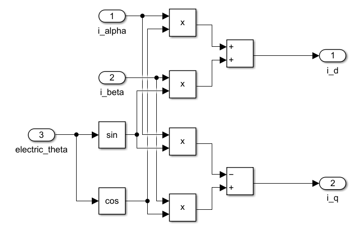

# Engine 4.3.1 SimpleFOC 开环控制

## 1. SimpleFOC 开环算法简介

> FOC 算法介绍可以参考4.2部分笔记。
>
> 本笔记以介绍 SimpleFOC 库为主，使用 STM32 + DengFOC 开发板 + 2804 云台电机进行测试。
>
> 本笔记不对 FOC 算法进行过于深入的推导，仅仅简要的介绍算法原理和代码编写。

### 逆变器电路

逆变器即 DC-AC 电路，将直流电转换为交流电。PMSM 的驱动使用三相交流电，使用三相桥式逆变器进行驱动：

$U_{dc}$称为母线电压。控制MOS管的开断可以控制三相电流流向，进而确定定子旋转磁场的方向，如下图所示。

对于三相逆变器的控制包括以下几种控制方式：

调制方式对称和非对称型调制方式，对称型调制使用一段高电平和一段PWM进行调制，非对称型使用全PWM或全高电平调制半个桥臂。使用非对称调制可以很方便的使用PWM控制转速，通常使用全PWM调制，此时上下桥臂的PWM波应为存在死区的互补方波防止短路。

### Clark 变换

PMSM 电机需要通入三相电流以产生旋转磁场，由相量法可知，三相电流可以用三个夹角为120°的相量进行表示，考虑到单独求解每一相的电流比较复杂，使用 Clark 变换将三相电流降维到静止的 $\alpha$-$\beta$ 坐标系进行降维解耦。

通过投影将三相电流向量投影到 $\alpha$-$\beta$ 坐标系下：
$$
i_\alpha = i_a - \frac{1}{2}i_b - \frac{1}{2}i_c \\
i_\beta = \frac{\sqrt{3}}{2}i_b + \frac{\sqrt{3}}{2}i_c
$$
即：
$$
\left[\begin{matrix}
i_\alpha \\
i_\beta
\end{matrix}\right] = P
\left[\begin{matrix}
1 & -\frac{1}{2} & -\frac{1}{2} \\
0 & \frac{\sqrt{3}}{2} & -\frac{\sqrt{3}}{2}
\end{matrix}\right]
\left[\begin{matrix}
i_a \\ 
i_b \\
i_c
\end{matrix}\right]
$$

$P$ 为系数，如果存在等幅值约束，可以得到 $P=\frac{2}{3}$；如果存在等功率约束，可以得到 $P=\sqrt{\frac{2}{3}}$。

为了使线性区调制比范围是 $[0,1]$ ，通常定义调制比为线电压幅值与直流母线电压的比值，如果采用等幅值 Clark 变换，坐标变换将不会改变电流的幅值。与等功率变换相比，等功率变换调制比范围将扩大，超出线性调制区原来的范围。所以采用等功率变换时，电流控制器输出的指令电压需要再乘以$P = \sqrt{\frac{2}{3}}$，才能给逆变器进行 PWM 调制。

为节省电流采样成本，通常使用基尔霍夫定律进行化简：
$$
i_a + i_b + i_c = 0
$$
则有：
$$
\left[\begin{matrix}
i_\alpha \\
i_\beta
\end{matrix}\right] = 
\left[\begin{matrix}
1 & 0 \\
\frac{1}{\sqrt{3}} & \frac{2}{\sqrt{3}} 
\end{matrix}\right]
\left[\begin{matrix}
i_a \\ i_b
\end{matrix}\right]
$$

### Park 变换

Clark 变换得到的 $i_\alpha$ 和 $i_\beta$ 在电机运行时仍然是变化的，为了进一步将电流和电角度解耦，可以考虑建立固连在转子上的 $d-q$ 坐标系，此时$i_d$，$i_q$和$\theta_e$被解耦。

Park 变换将定子静止的$\alpha$和$\beta$坐标系转换为固连在转子上的$d$和$q$坐标系，便于描述电机旋转时的电流规律。$d$ 轴平行于转子永磁体，$q$轴垂直于转子。$dq$坐标系相对于$\alpha \beta$坐标系旋转的角度为电角度。

$$
\left[\begin{matrix} i_d \\ i_q \end{matrix}\right] = \left[\begin{matrix} cos\theta_e & sin\theta_e \\ -sin\theta_e & cos\theta_e \end{matrix}\right] \left[\begin{matrix} i_\alpha \\ i_\beta \end{matrix}\right]
$$

$i_q$ 产生电机的力矩，是电机力矩环（电流环）的驱动目标，$i_d$ 产生电机的热量，通常需要控制为0。$\theta_e$表征电机的位置，是电机位置环的驱动目标。

### SVPWM 

假设定子可以视为对称三相负载，则三相电流和三相线电压呈线性关系，SVPWM 用于产生三相线电压从而产生三相定子电流。

由三相逆变器的六个开关元件组成的特定开关模式，使输出电压波形尽可能接近于理想的正弦波形。SVPWM计算的是三相逆变器的六个开关何时导通，何时切断。

1. 空间矢量

定义ABC三个桥臂分别有0,1两种状态，0是下管开通上管关断，1是上管开通下管关断。（同一个半桥不可同时导通上下桥臂）。考虑到不同开关模式的三相线电压状态组成不同相位的电压相量，即有6个非零矢量（001，010，011，100，101，110）和两个零矢量（000，111）。

| $S_a$ | $S_b$ | $S_c$ | 矢量符号 | $U_a$                | $U_b$                | $U_c$                |
| ----- | ----- | ----- | -------- | -------------------- | -------------------- | -------------------- |
| 0     | 0     | 0     | $U_0$    | 0                    | 0                    | 0                    |
| 1     | 0     | 0     | $U_4$    | $\frac{2}{3}V_{cc}$  | $-\frac{1}{3}V_{cc}$ | $-\frac{1}{3}V_{cc}$ |
| 1     | 1     | 0     | $U_6$    | $\frac{1}{3}V_{cc}$  | $\frac{1}{3}V_{cc}$  | $-\frac{2}{3}V_{cc}$ |
| 0     | 1     | 0     | $U_2$    | $-\frac{1}{3}V_{cc}$ | $\frac{2}{3}V_{cc}$  | $-\frac{1}{3}V_{cc}$ |
| 0     | 1     | 1     | $U_3$    | $-\frac{2}{3}V_{cc}$ | $\frac{2}{3}V_{cc}$  | $\frac{2}{3}V_{cc}$  |
| 0     | 0     | 1     | $U_1$    | $-\frac{1}{3}V_{cc}$ | $-\frac{1}{3}V_{cc}$ | $\frac{2}{3}V_{cc}$  |
| 1     | 0     | 1     | $U_5$    | $\frac{1}{3}V_{cc}$  | $-\frac{2}{3}V_{cc}$ | $\frac{1}{3}V_{cc}$  |
| 1     | 1     | 1     | $U_7$    | 0                    | 0                    | 0                    |

由此可以将电压矢量分为六个扇区：

当电压不在六个标准电压矢量上时，为了得到该电压矢量，通常使用互补PWM控制逆变器，再由伏秒平衡原则(一个周期内，作用时间越长，作用值越大)产生对应电压相量(即发波方式)。

2. 扇区判断

如果存在传感器，可以通过电角度直接判断电压矢量的扇区。如果为无感控制，使用 $U_\alpha$ 和 $U_\beta$ 也可进行扇区判断。

| 扇区 | 角度条件                                                   | 比例条件                               |
| ---- | ---------------------------------------------------------- | -------------------------------------- |
| 1    | $0 < arctan(\frac{U_\beta}{U_\alpha}) < 60^\circ$          | $0<\frac{U_\beta}{U_\alpha}<\sqrt{3}$  |
| 2    | $60^\circ < arctan(\frac{U_\beta}{U_\alpha}) < 120^\circ$  | $|\frac{U_\beta}{U_\alpha}|>\sqrt{3}$  |
| 3    | $120^\circ < arctan(\frac{U_\beta}{U_\alpha}) < 180^\circ$ | $0>\frac{U_\beta}{U_\alpha}>-\sqrt{3}$ |
| 4    | $180^\circ < arctan(\frac{U_\beta}{U_\alpha}) < 240^\circ$ | $0<\frac{U_\beta}{U_\alpha}<\sqrt{3}$  |
| 5    | $240^\circ < arctan(\frac{U_\beta}{U_\alpha}) < 300^\circ$ | $|\frac{U_\beta}{U_\alpha}|>\sqrt{3}$  |
| 6    | $300^\circ < arctan(\frac{U_\beta}{U_\alpha}) < 360^\circ$ | $0>\frac{U_\beta}{U_\alpha}>-\sqrt{3}$ |

> 简化扇区判断条件：
> 
> - $U_1$ = $U_\beta$
> - $U_2 = \frac{\sqrt{3}}{2}U_\alpha - \frac{1}{2}U_\beta$
> - $U_3 = - \frac{\sqrt{3}}{2}U_\alpha - \frac{1}{2}U_\beta$
>
> 令A，B，C，取值条件如下：
>
> - $U_1 > 0$，$A = 1$，反之为0；
> - $U_2 > 0$，$B = 1$，反之为0；
> - $U_3 > 0$，$C = 1$，反之为0；
>
> $N = 4C + 2B + A$，则扇区确定条件如下：
>
> | 扇区 | A    | B    | C    | N    |
> | ---- | ---- | ---- | ---- | ---- |
> | 1    | 1    | 1    | 0    | 3    |
> | 2    | 1    | 0    | 0    | 1    |
> | 3    | 1    | 0    | 1    | 5    |
> | 4    | 0    | 1    | 1    | 4    |
> | 5    | 0    | 1    | 1    | 6    |
> | 6    | 0    | 0    | 0    | 2    |

3. 发波方式

为了减少谐波，采用七段式或五段式的发波方法

- 七段式发波方法

以扇区1为例：

注意，每次发波只控制一个桥臂的MOS通断。

发波顺序：0-4-6-7-6-4-0 或 7-6-4-0-4-6-7。

如果考虑软件的计算方便，每次发波都先发000矢量，中间插入111矢量，那么就要按照图中红色曲线发波。

无论七段式SVPWM还是五段式SVPWM，在一个开关周期内，一个开关都只做一次动作。但是由于七段式在一个周期内比五段式多插入了一个零矢量，导致电流频率是开关频率的两倍。 同时七段式的开关损耗比五段式多了1/3。

此时控制桥臂的互补PWM应为中心对齐模式。

- 五段式发波方法

五段式SVPWM，又被称为DPWM。由于其在一个开关周期内只插入了一个零矢量，是不连续的SVPWM。而在不同扇区内对零矢量的不同选择，导致了DPWM有很多个变种，每个变种对开关管的损耗、相电压的谐波都会造成不同的结果。

1. DPWM有最基本的两条路径，如下图所示：

如果在六个扇区内都选择插入000矢量，那么六个扇区内的矢量分别是6-4-0-4-6，6-2-0-2-6，3-2-0-2-3，3-1-0-1-3,5-1-0-1-5,5-4-0-4-5，如下图蓝色曲线；

如果在六个扇区内都选择插入111矢量，那么六个扇区内的矢量分别是4-6-7-6-4，2-6-7-6-2，2-3-7-3-2，1-3-7-3-1,1-5-7-5-1,4-5-7-5-4，如下图红色曲线；

2. 以上方式会导致MOS管发热不均匀，为解决此问题，采用奇数扇区插入和偶数扇区相反的零矢量：

4. 发波时间计算

以第一扇区为例，按伏秒平衡的原则来合成该扇区内的任意电压矢量。式中$T$为PWM周期，$\frac{T_4}{T}$为$U_4$对应的占空比。

$U_{ref}T = U_4T_4 + U_6T_6 + U_0(T - T_4-T_6)$

以此类推：

| 扇区 | N    | $T_x$                                                        | $T_y$                                                        |
| ---- | ---- | ------------------------------------------------------------ | ------------------------------------------------------------ |
| 1    | 3    | $\frac{\sqrt{3}T_S}{U_{dc}}(\frac{\sqrt{3}}{2}U_\alpha - \frac{1}{2}U_\beta)$ | $\frac{\sqrt{3}T_S}{U_{dc}}U_\beta$                          |
| 2    | 1    | $\frac{\sqrt{3}T_S}{U_{dc}}(-\frac{\sqrt{3}}{2}U_\alpha + \frac{1}{2}U_\beta)$ | $\frac{\sqrt{3}T_S}{U_{dc}}(\frac{\sqrt{3}}{2}U_\alpha + \frac{1}{2}U_\beta)$ |
| 3    | 5    | $\frac{\sqrt{3}T_S}{U_{dc}}U_\beta$                          | $ - \frac{\sqrt{3}T_S}{U_{dc}}(\frac{\sqrt{3}}{2}U_\alpha + \frac{1}{2}U_\beta)$ |
| 4    | 4    | $- \frac{\sqrt{3}T_S}{U_{dc}}U_\beta$                        | $\frac{\sqrt{3}T_S}{U_{dc}}(- \frac{\sqrt{3}}{2}U_\alpha + \frac{1}{2}U_\beta)$ |
| 5    | 6    | $- \frac{\sqrt{3}T_S}{U_{dc}}(\frac{\sqrt{3}}{2}U_\alpha + \frac{1}{2}U_\beta)$ | $- \frac{\sqrt{3}T_S}{U_{dc}}(- \frac{\sqrt{3}}{2}U_\alpha + \frac{1}{2}U_\beta)$ |
| 6    | 2    | $\frac{\sqrt{3}T_S}{U_{dc}}(\frac{\sqrt{3}}{2}U_\alpha + \frac{1}{2}U_\beta)$ | $- \frac{\sqrt{3}T_S}{U_{dc}}U_\beta$                        |

4. PWM占空比计算

如图，以第一扇区为例，由于发波需要对称，所以零矢量被均分为两段。

以此类推：

| 扇区 | N    | $T_a$                       | $T_b$                       | $T_c$                       |
| ---- | ---- | --------------------------- | --------------------------- | --------------------------- |
| 1    | 3    | $\frac{T_s - T_x - T_y}{4}$ | $\frac{T_s + T_x - T_y}{4}$ | $\frac{T_s + T_x + T_y}{4}$ |
| 2    | 1    | $\frac{T_s + T_x - T_y}{4}$ | $\frac{T_s - T_x - T_y}{4}$ | $\frac{T_s + T_x + T_y}{4}$ |
| 3    | 5    | $\frac{T_s + T_x + T_y}{4}$ | $\frac{T_s - T_x - T_y}{4}$ | $\frac{T_s + T_x - T_y}{4}$ |
| 4    | 4    | $\frac{T_s + T_x + T_y}{4}$ | $\frac{T_s + T_x - T_y}{4}$ | $\frac{T_s - T_x - T_y}{4}$ |
| 5    | 6    | $\frac{T_s + T_x - T_y}{4}$ | $\frac{T_s + T_x + T_y}{4}$ | $\frac{T_s - T_x - T_y}{4}$ |
| 6    | 2    | $\frac{T_s - T_x - T_y}{4}$ | $\frac{T_s + T_x + T_y}{4}$ | $\frac{T_s + T_x - T_y}{4}$ |

## 2. SimpleFOC 开环算法仿真

1. 三相电流生成器

2. Clark 变换模块

> Clark 算法验证：
>
> 
>
> 
>
> 

3. Park - Antipark 变换模块

- Park 变换

- AntiPark 变换

>Park 算法验证：
>
>
>
>
>
>

4. SVPWM 模块

- 扇区选择模块

- 中间变量X，Y，Z求取模块，用于求取$T_4$和$T_6$。

- $T_4$，$T_6$计算模块

- PWM 占空比计算模块

