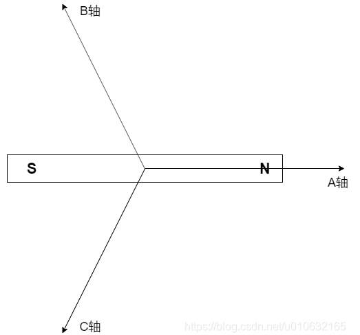
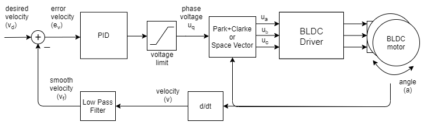
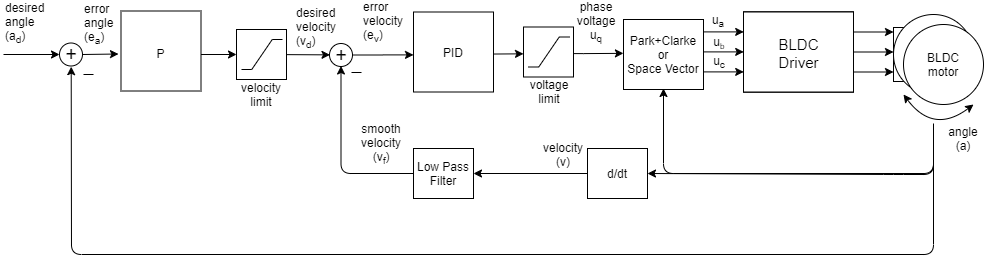

# Engine 4.3.3 SimpleFOC 速度/位置闭环控制

## 1. 零点校准

在开环控制中，使用的电角度是由电角度生成器生成的，在有感FOC闭环控制中，电角度是通过固连在PMSM转子上的编码器得到的。

但是，通常编码器的零点和电角度零点(A轴)会存在一定的角度误差，如果忽略误差，认为上电时的机械角度和电角度相同，可能会导致速度/位置控制力矩小或者产生振荡。

零点校准的目的是将转子位置对齐A轴后读取当前机械位置为机械偏移量，从而实现准确的闭环控制。



为了将转子对齐A轴，需要**生成指向A轴的电压矢量**。通常有两种方式：

> - $U_d = u_d,U_q = 0,\theta_e = 0$；
> - $U_d = 0,U_q = u_q,\theta_e = 270°$。 

```c
    // 计算零点偏移方向
    set_phase_voltage(2.5, 0, _3PI_2);
    HAL_Delay(700);
    zero_electric_angle = _normalizeAngle(_electricalAngle((int)(sensor_direction)*AS5600_Read_Angle(), POLE_PAIRS));
    HAL_Delay(20);
    printf("Zero elec. angle:");
    printf("%.4f\r\n", zero_electric_angle);
    set_phase_voltage(0, 0, 0);
    HAL_Delay(200);
```

## 2. 编码器方向判定

电机电角度的旋转正方向和编码器旋转正方向在安装和三相线接入后方能确定。通过旋转判定方向。

```c
    // 开环正转 2PI
    for (i = 0; i <= 500; i++) {
        open_angle = _3PI_2 + _2PI * i / 500.0;
        set_phase_voltage(2.5, 0, open_angle);
        HAL_Delay(2);
    }

    mid_angle = AS5600_Read_Angle();

    // 开环反转 2PI
    for (i = 500; i >= 0; i--) {
        open_angle = _3PI_2 + _2PI * i / 500.0;
        set_phase_voltage(2.5, 0, open_angle);
        HAL_Delay(2);
    }

    end_angle = AS5600_Read_Angle();

    // 判断编码器方向
    moved = fabs(mid_angle - end_angle);
    if ((mid_angle == end_angle) || (moved < 0.02)) {
        printf("Failed to notice movement.\r\n");
        HAL_GPIO_WritePin(GPIOA, GPIO_PIN_15, GPIO_PIN_RESET);
        return 0;
    } else if (mid_angle < end_angle) {
        printf("sensor_direction:CCW\r\n");
        sensor_direction = CCW;
    } else {
        printf("sensor_direction:CW\r\n");
        sensor_direction = CW;
    }
    set_phase_voltage(0, 0, 0);
```

## 3. 速度/位置闭环控制

### 速度闭环控制

系统框图如下所示：



考虑到磁编码器可能存在较大的噪声，速度通常为低频信号，使用LPF进行滤波得到速度值。

磁编码器的速度采样率建议在 100Hz 到 1kHz（高频采样容易导致速度噪声过大），LPF 建议将过去值权重调大。

使用PI控制器控制速度。

### 位置闭环控制

系统框图如下所示：


