# Engine 4.4.1 VESC 基本使用

## 1. VESC 简介和硬件方案

VESC是一个开源的ESC（电动速度控制器），它是按照创建者Benjamin Vedder的名字Vedder来命名。 它发布于2016年。Vedder在他的电动滑板上测试了它，因为该款控制器具有很强的兼容性和编程特性，它很快在电动滑板玩家群里流行起来。

VESC 作者的 Github 仓库：[链接](https://github.com/vedderb)

目前， VESC4 是完全开源的，VESC6 是半开源的（PCB 闭源），因此使用 VESC6 需要进行硬件移植后自行打板使用（或者采用市面上的一些方案）

- VESC 和 Odrive 的区别：

  |      | Odrive                                                       | VESC                                                         |
  | ---- | ------------------------------------------------------------ | ------------------------------------------------------------ |
  | 优势 | 1. C++语言，接口更好. 2. fibre通信协议比较好用，python测试脚本等比较容易编写. 3. 硬件采用 STM32Cube 自动生成，入门更加简单. 4. 编码器接口比较全面 | 1. 项目比较全面，包括电机驱动、上位机（支持多平台）、BMS、bootloader等 2. C语言，国内很多将它移植到了 Keil 环境下面，更加方便 3. 上位机功能比较全面 4. 采用chibios系统中的硬件抽象，容易移植到其他平台下面 |
  | 劣势 | 1. 文档支持不全面，对于gui/tools/docs的环境搭建介绍不全面 2. 构建采用tup，编写的时候需要重新学 3. 现在基本停止更新 4. 环境搭建比较麻烦，依赖很多 5. 深度绑定stm32，移植到其他平台要做很多事情 6. 上位机使用比较麻烦 | 1. C语言，接口封装没有C++好 2. 上位机采用qt，商用上存在一点问题 |

## 2. VESC 基本配置

### 上位机下载

VESC 官网：[VESC Project (vesc-project.com)](https://vesc-project.com/)

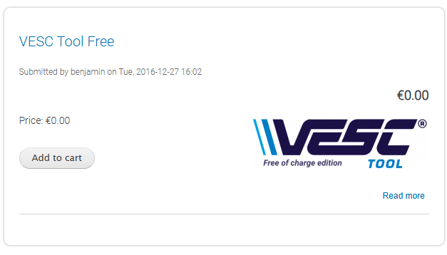

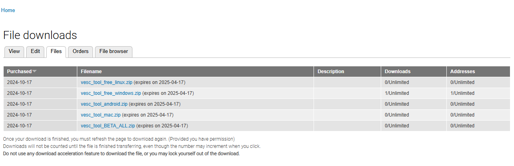

根据系统版本下载即可。

### 固件烧录和升级

> VESC 使用固件版本为5.01，硬件版本为6.0。（永刚驱动）
>
> VESC Tool 版本：6.05

1. 使用 STM32 ST-LINK Utility 烧录原始固件（后续步骤会进行升级）

   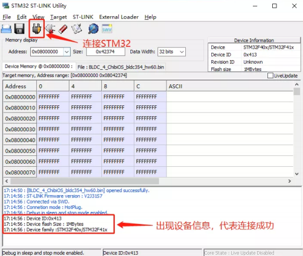

   点击连接，待出现设备信息后证明连接成功。

   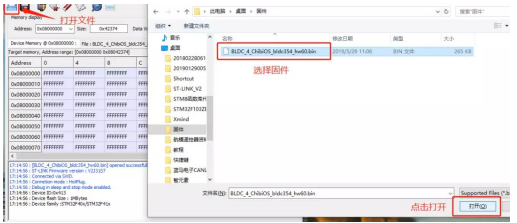

   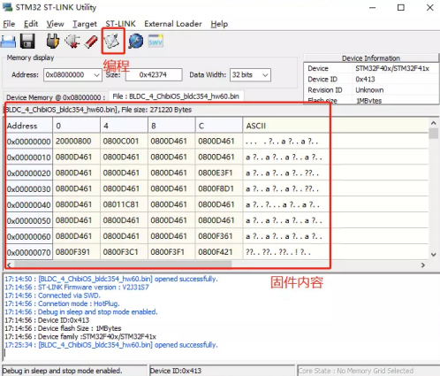

   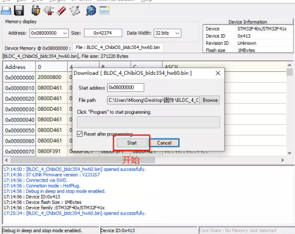

   待日志框中出现下图绿色字体，并且显示出STM32片内FLASH信息，则证明下载成功。

   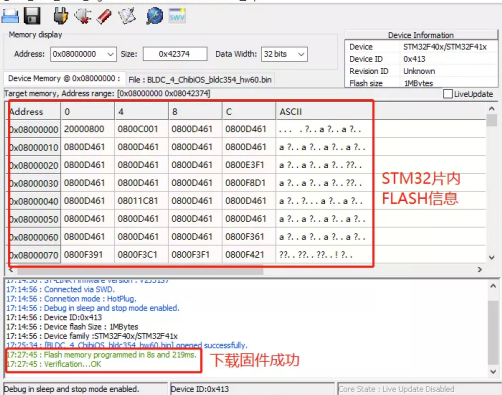

2. 升级固件

   首先连接VESC：

   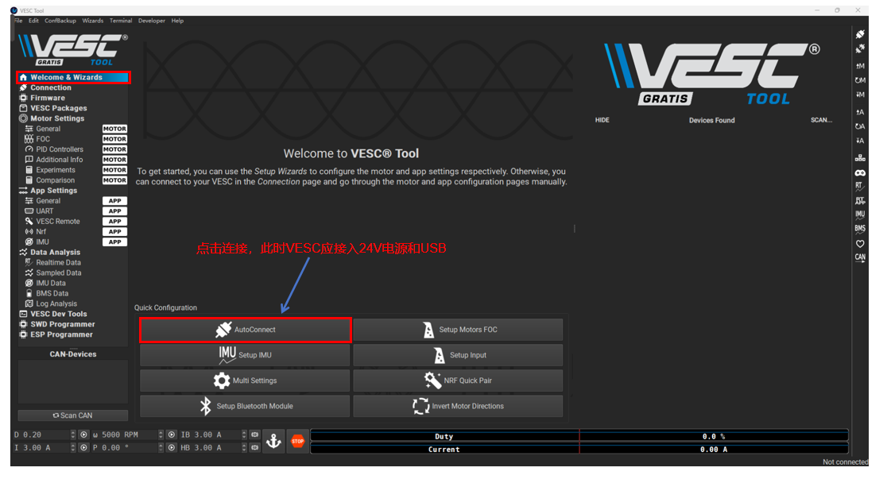

   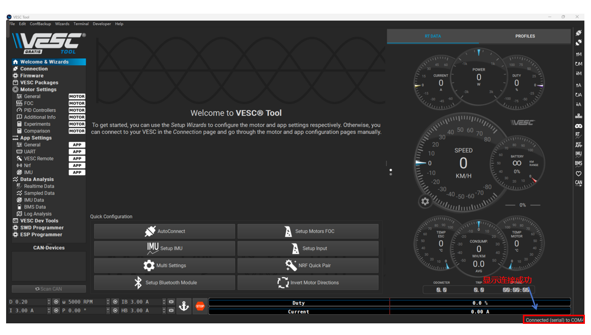

   下载 Bootloader 固件：

   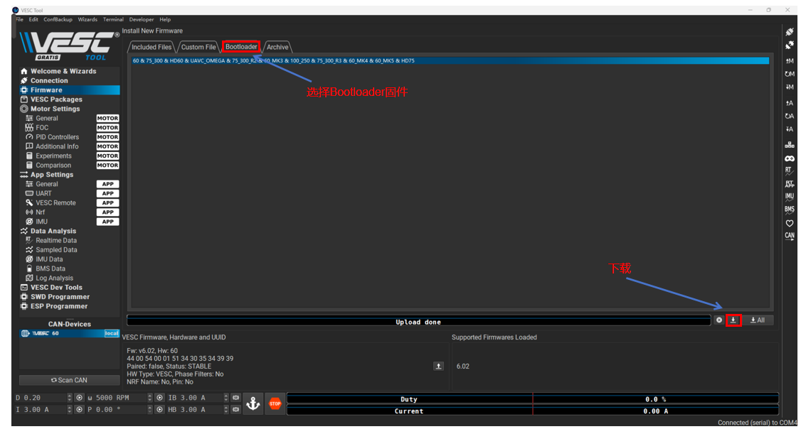

   下载 APP 固件：
   
   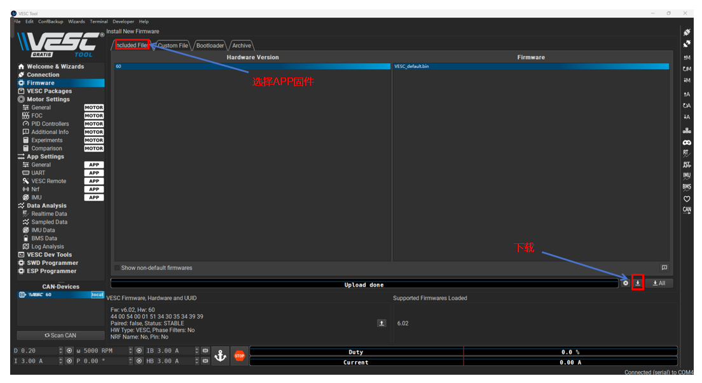

   > Bootloader 是用来烧录 APP 应用程序的，每次 STM32 上电，都要执行 Bootloader程序，然后才执行 APP 固件内部的应用程序。

   烧录完成固件后，VESC会自动断开连接，等待10s再次连接VESC，连接成功会在软件底部提示绿色字体，证明连接成功。到此固件升级成功。

### 电机连接测试

首先连接电机三相线（不必连接传感器，首先使用无感方式测试）

1. 配置电机
   
      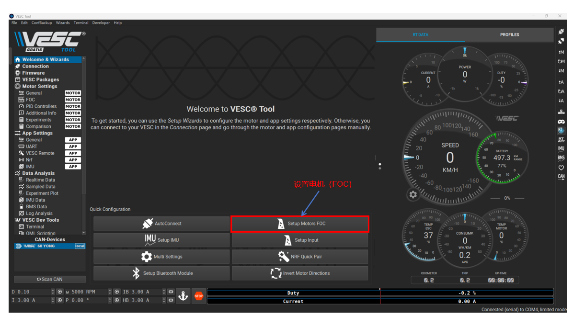
   
      选择电机用途：Generic
   
      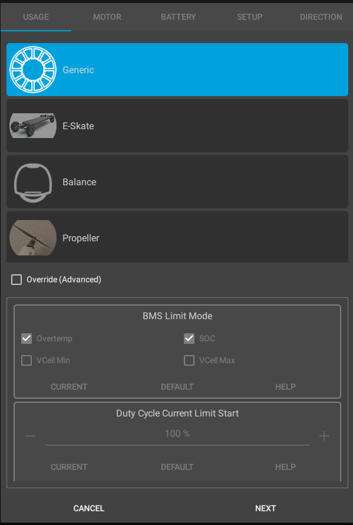
   
      选择电机功率和类型（Outrunner 为外转子电机，Inrunner 为内转子电机），注意电机功率应选择合适功率，如果功率选择偏小会使得电机振动，偏大会使得电机过热损毁。
   
      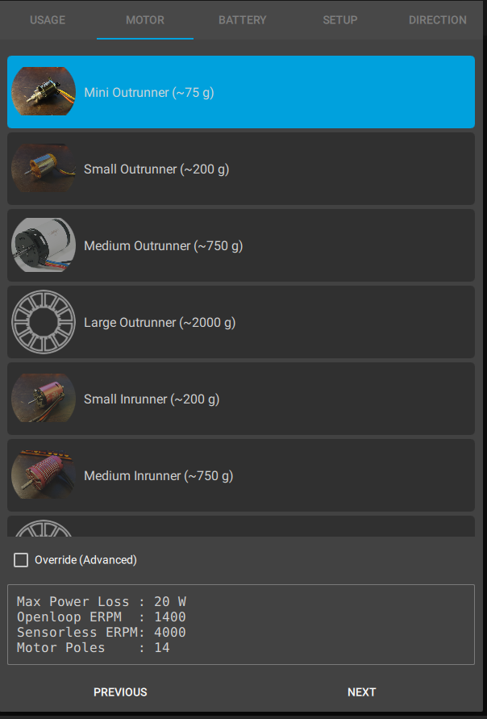
   
      选择供电电源，一般单节锂电池的操作电压在 4.2V - 3.1V 之间，当电池电压低于 3.1V，这时你还要给电池继续放电，就会对电池造成损坏。为了避免造成损坏，VESC 就会在电压低于 3.4V 的时候开始软切断电源，当低于 3.1V 的时候就会直接切断电源。这里需要填入锂电池的串数，24V的锂电池组大部分都是7串的，也有小部分6串的。
   
      Battery Current Max（电池电流最大值）：设置你的电池持续电流最大值，这需要参考电池规格型号。
   
      Battery Current Max Regen（电池回收电流最大值）：因为刹车的时候，电机会产生反向电流来给电池充电，但是电池充电电流也是有限制的，具体限制多少可以参考电池充电器充电电流。
   
      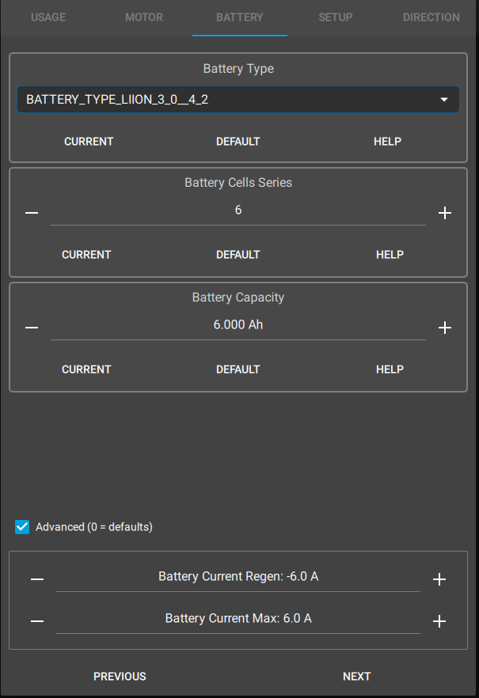
   
      极对数，减速比和温敏电阻设置，注意如果无减速箱则选择 Direct Drive，极对数填写电机极数（两倍极对数）。
   
      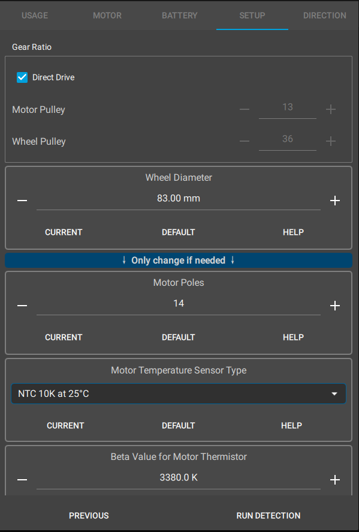
   
      
   
      随后运行电机参数测量，电机会首先啸叫（测量电感和电阻），然后高速正转并正反转（测量励磁磁场和凸极性质）：
   
      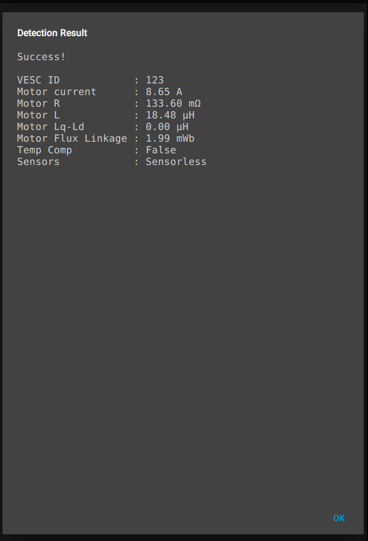
   
      测量结束，此时可以测试电机正反转（VESC Tool 6.05 好像不会产生剧烈振动）。

2.  驱动电机运动

   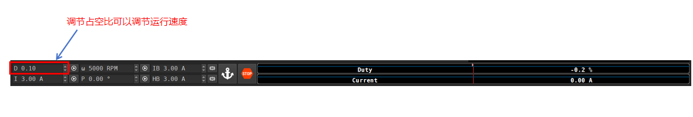

   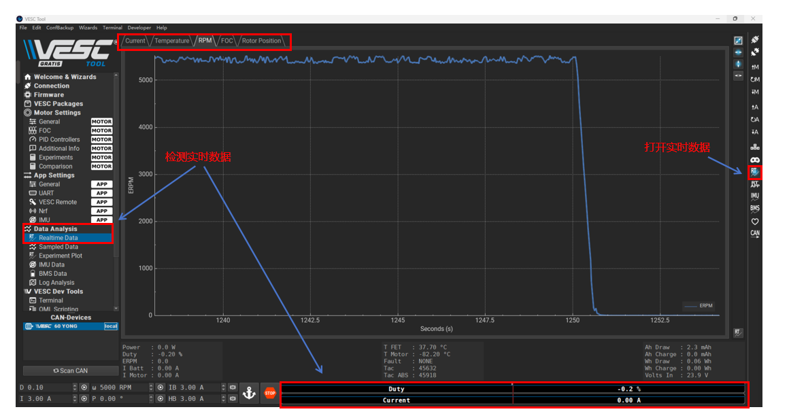

   

   

   
