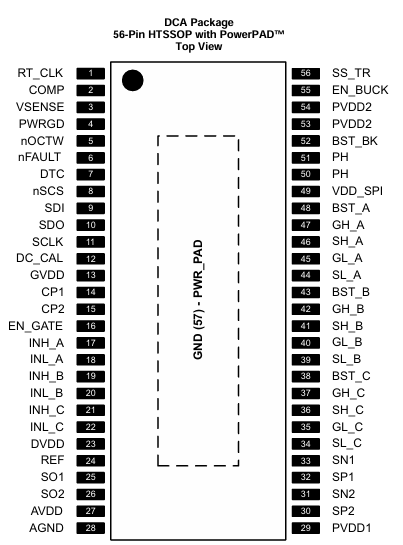
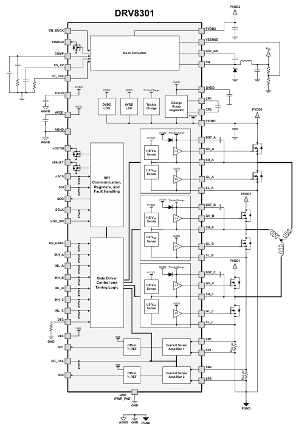
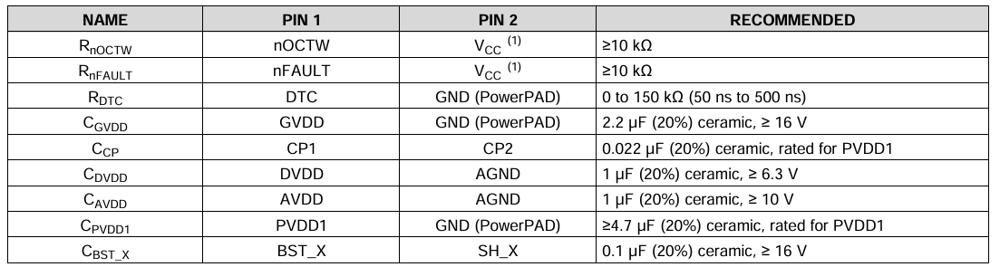
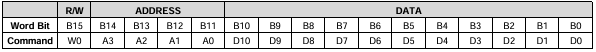
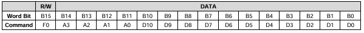
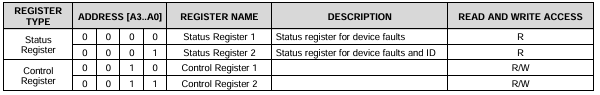
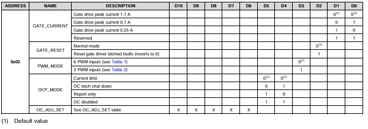
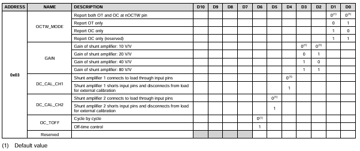
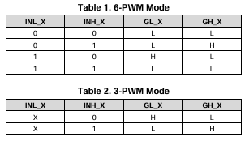
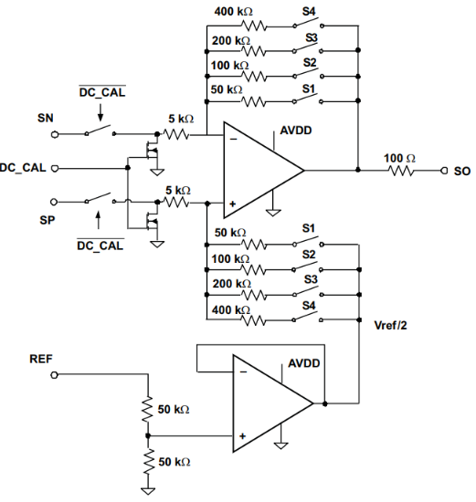

# Engine 4.3 DRV8301简介

- SPI 通信和故障指示：

  |name	|NO.	|Type	|描述|
  |-|-|-|-|
  |nOCTW	|5|	O| 过流、过温报警指示。开漏输出，**需要外部上拉电阻。**可通过SPI修改寄存器来配置输出模式，**低电平表示故障。** |
  |nFAULT	|6	|O| 故障指示。开漏输出，**需要外部上拉电阻。低电平表示故障。** |
  |nSCS	|8	|I|	SPI片选|
  |SDI	|9	|I|	MOSI|
  |SDO	|10	|O|	MISO|
  |SCLK	|11	|I|	SCK|
  |VDD_SPI	|49	|I|	SPI供电电源，可以使用3.3V或5V|
  
  > SPI 说明：
  >
  > 1. DRV8301 是一个从机，使用 16 位 SPI。
  >
  > 2. SPI 输入指令 (SDI)
  >
  >    
  >
  >    第一位为读写指示位（0是写数据指令，1是读数据指令），A3 - A0 位是寄存器地址位，剩余是数据位；
  >
  > 3. SPI 输出指令 (SDO)
  >
  >    
  >
  >    第一位为错误指示位，A3 - A0 位是寄存器地址位，剩余是数据位；
  >
  > 4. 寄存器地址
  >
  >    
  >
  >    0x00状态寄存器是故障指示，0x01状态寄存器是设备ID。
  >
  >    0x02寄存器控制栅极驱动电流大小、栅极驱动复位、PWM模式、过流保护模式、过流保护电压值。
  >
  >    
  >
  >    0x03寄存器控制nOCTW报告过流或过温故障、电流增益、直流校准功能、过流保护的限流模式。
  >
  >    

- 栅极驱动引脚

  |name	|NO.	|Type	|描述|
  |-|-|-|-|
  |INH_A	|17	|I	|半桥A高侧PWM输入
  |INL_A	|18|	I	|半桥A低侧PWM输入
  |INH_B	|19	|I	|半桥B高侧PWM输入
  |INL_B	|20|	I	|半桥B低侧PWM输入
  |INH_C	|21	|I	|半桥C高侧PWM输入
  |INL_C	|22|	I|	半桥C低侧PWM输入
  |DTC	|7	|I	|外接一个电阻到GND来调整死区时间。0到150K对应50ns到500ns的死区时间。

  > PWM 模式有 6-PWM 和 3-PWM，6-PWM 就是使用 6 个 PWM 来控制3个半桥，3-PWM 就是使用 3 个 PWM 来控制3个半桥（上桥臂）。
  >
  > 

- 逆变桥引脚

  |name	|NO.	|Type	|描述|
  |-|-|-|-|
  |SL_C	|34|	I|	半桥C低侧MOSFET的源极。|
  |GL_C	|35|	O|	半桥C低侧MOSFET的栅极驱动输出。|
  |SH_C	|36|	I|	半桥C高侧MOSFET的源极。|
  |GH_C	|37|	O|	半桥C高侧MOSFET的栅极驱动输出。|
  |BST_C|38|	P|	半桥C自举电容。|
  |SL_B	|39|	I|	半桥B低侧MOSFET的源极。|
  |GL_B	|40|	O|	半桥B低侧MOSFET的栅极驱动输出。|
  |SH_B	|41|	I|	半桥B高侧MOSFET的源极。|
  |GH_B	|42|	O|	半桥B高侧MOSFET的栅极驱动输出。||
  |BST_B|43|	P|	半桥B自举电容。|
  |SL_A	|44|	I|	半桥A低侧MOSFET的源极。|
  |GL_A	|45|	O|	半桥A低侧MOSFET的栅极驱动输出。|
  |SH_A	|46|	I|	半桥A高侧MOSFET的源极。|
  |GH_A	|47|	O|	半桥A高侧MOSFET的栅极驱动输出。|
  |BST_A|48|	P|	半桥A自举电容。|
  |SN1	|33|	I|	连接到电流采样电阻1的上侧|
  |SP1	|32|	I|	连接到电流采样电阻1的下侧|
  |SN2	|31|	I|	连接到电流采样电阻2的上侧|
  |SP2	|30|	I|	连接到电流采样电阻2的下侧|
  |SO1	|25|	O|	电流放大器1的输出|
  |SO2	|26|	O|	电流放大器2的输出|
  |REF	|24|	I|	设置采样电流放大器的偏置电压，该偏置电压值等于本引脚上电压的一半。连接到MCU的ADC参考电压上。|
  |DC_CAL|	12|	I|	当DC_CAL拉高时，器件短路采样电流放大器的输入并断开负载。直流偏置校正可通过外部单片机实现。|
  > DC_CAL引脚：
  >
  > 1. 采样电流放大器
  >
  >    
  >
  >    - 电流放大器提供高达 3V 的输出偏置，以支持双向电流检测。偏移量被设置为参考引脚(REF)上电压的一半。
  >
  >    - DC_CAL 拉低时，SN 和 SP 对电流进行差分采样，经过差分放大器放大输出到 SO，从而输入到单片机进行电流采样。
  >
  >    	$$
  >    	U_O = \frac{1}{2}U_{REF}-G(SN_x-SP_x)
  >    	$$
  >
  >    - 为了减小直流偏置和漂移超温，提供了一种通过DC_CAL引脚或SPI寄存器进行校准的方法。当直流校准启用时，设备将短路电流放大器的输入并断开负载。为了获得最好的结果，在无负载时进行直流校准，以减少潜在的噪声对放大器的影响。
  >
  >    - 四个开关用 SPI 进行配置，有四个可编程增益设置，分别是10、20、40和80V/V。

- 电源相关引脚

  |name	|NO.	|Type|	描述|
  |-|-|-|-|
  |DVDD	|23|	P	|内部3.3 v供电电压。|
  |AVDD	|27	|P	|内部6v供电电压。|
  |AGND	|28|	P	|模拟地。|
  |GVDD	|13|	P	|内部栅驱动电压调节器。|
  |CP1	|14|	P	|电荷泵引脚。|
  |CP2	|15|	P	|电荷泵引脚。|
  |PVDD1|	29|	P	|栅极驱动器、采样电流放大器和 SPI 通信的电源。PVDD1 是和 buck 电源 PVDD2 独立的。|

  > 电荷泵是开关电容升压器，用于向栅极驱动器、采样电流放大器和 SPI 通信提供电源。
  >
  > 半桥自举电容和电荷泵电容的工作原理相似。
  >
  > $C_{GVDD}$ 通常选用 2.2uF 陶瓷电容，耐压值最小 16V.
  >
  > $C_{CP}$ 通常选用 0.022uF 的电容，耐压值至少为 PVDD.
  
  > - **欠压保护（PVDD_UV GVDD_UV）**
  >
  >   当 PVDD 或 GVDD 低于其欠压阈值(PVDD_UV/GVDD_UV)时，DRV8301 通过拉低 GH_X 、GL_X 提供欠压保护。这将使外部 MOSFET 处于高阻抗状态。当设备处于 PVDD_UV 时，它将不响应 SPI 命令，SPI 寄存器将恢复到默认设置。
  >   PVDD1 从 13µs 到 15µs 的瞬时欠压限电，会导致 DRV8301 对外部输入无响应，直到满功率周期。瞬态条件是PVDD1 大于 PVDD_UV 水平，然后 PVDD1 在 13 ~ 15µs 的特定时间内降至 PVDD_UV 水平以下。瞬变时间短于或长于 13 ~ 15µs 不会影响欠压保护的正常运行。**可以在PVDD1上增加额外的大电容以减少欠压瞬变。**
  >
  > - **过压保护（GVDD_OV）**
  >
  >   如果 GVDD 电压超过 GVDD_OV 阈值，设备将关闭栅极驱动器和电荷泵，以防止与 GVDD 引脚或电荷泵相关的潜在问题(例如，外部 GVDD 电容或电荷泵电容短路)。故障是一个锁存故障，只能通过 EN_GATE 引脚上的复位转换来复位。
  >
  > - **过温保护**
  >   **1级: 超温警报(OTW)**
  >   对于默认设置，OTW 通过 nOCTW 引脚(过流和/或过温警告)报告。OCTW 引脚可以设置为仅通过 SPI 寄存器报告 OTW 或 OCW。参见SPI寄存器部分。
  >   **2级: 门驱动器和电荷泵的超温锁存关闭(OTSD_GATE)**
  >   OTSD_GATE 通过 nFAULT 引脚报告。这是一个闩锁关闭，所以门驱动器不会自动恢复，即使超温条件不再存在。EN_GATE 复位或 SPI (RESET_GATE)需要在温度低于预设值 tOTSD_CLR 后恢复门驱动器正常运行。
  >   SPI 操作仍然可用，在 OTSD 操作期间，只要 PVDD1 在定义的操作范围内，寄存器设置就会保留在设备中。
  >
  > - **过流保护**
  >
  >   由于 MOSFET 有内阻，通过 VDS 可以把电流值转换为电压值，再和通过 SPI 修改寄存器设置的过流值比较判断是否出发过流保护。
  >
  >   高侧过流保护是采集PVDD1和SH_X之间的电压，低侧是采集SH_X和SL_X之间的电压，因此他们最好差分走线来消除PCB线阻差异。设置的过流值最好留20%的余量。
  >   通过SPI寄存器可以设置四种不同的过流模式(OC_MODE)。OC状态位以锁存模式操作。当过流情况发生时，对应的OC状态位将锁定在DRV8301寄存器中，直到下一个SPI读取命令。在读取命令之后，OC状态位将从寄存器中清除，直到出现另一个过流状态。
  >
  >   > 1. 限流模式
  >   >
  >   >    在限流模式下，设备在过流事件期间使用电流限制而不是设备关机。
  >   >
  >   >    在这种模式下，设备通过 nOCTW 引脚报告过流事件。nOCTW 引脚将被保持低最大 64µs 周期(内部定时器)或直到下一个 PWM 周期。如果另一个过流事件由另一个 MOSFET 触发，在先前的过流事件期间，报告将继续另一个 64µs 周期(内部定时器将重新启动)或直到两个 PWM 信号周期。在检测到过流的场效应晶体管中，将置位相关的状态位。
  >   >    在限流模式中有两个电流控制设置。这些是由 SPI 寄存器中的一位设置的，默认模式为 CBC (cycle by cycle)。
  >   >
  >   >    Cycle by Cycle mode (CBC)：在CBC模式下，检测到过流的MOSFET将关闭，直到下一个 PWM 周期。
  >   >
  >   >    Off-Time 控制模式：在 Off-Time 模式下，当 MOSFET 检测到过流时，关闭时间为64µs(由内部定时器设置)。如果在另一个 MOSFET 中检测到过流，定时器将重置另一个 64µs周期，两个 MOSFET 将在此期间被禁用。在此期间，特定 MOSFET 的正常运行可以通过相应的 PWM 周期恢复。
  >   >
  >   > 2. 锁存关闭模式
  >   >
  >   >    当过流事件发生时，高边和低边 MOSFET 将在相应的半桥中被禁用。nFAULT 引脚和 nFAULT 状态位将与检测过流的 MOSFET 的相关状态位一起被激活。OC 状态位将锁定直到下一个 SPI 读取命令。nFAULT 引脚和 nFAULT 状态位将锁定，直到通过 GATE_RESET 位接收到复位或快速的 EN_GATE 复位脉冲。
  >   >
  >   > 3. 只报告模式
  >   >
  >   >    在此模式下，当发生过流事件时，不会采取保护动作。过流事件将通过 nOCTW 引脚(64μs脉冲)和 SPI 状态寄存器报告。外部单片机应根据自身的控制算法采取相应的行动。
  >   >
  >   > 4. OC 禁用模式
  >   >
  >   >    设备将忽略且不报告所有过流检测。
  >
  > - **故障处理**
  >
  >   nFAULT 引脚指示何时发生关机事件，这些事件包括过流、过温、过压或欠压。注意，nFAULT 是一个开漏信号。在开机启动过程中，当栅极驱动为 PWM 输入做好准备时，nFAULT 将会拉高。
  >   nOCTW 引脚指示过流事件或过温事件何时发生。这些事件与关机无关。

- Buck 相关引脚

  |name	|NO.	|Type	|描述|
  |-|-|-|-|
  |EN_BUCK|	55	|I	|buck电源使能引脚。悬空使能。使用两个电阻来调节输入电压锁定值。
  |PWRGD	|4	|O	|开漏输出，需要外部上拉。如果由于热关闭、dropout、过压或EN_BUCK关闭而导致buck输出电压低，则该脚会输出低。
  |COMP|	2	|O	|降压误差放大器的输出和输入到输出开关电流比较器。
  |SS_TR|	56	|I	|Buck软启动和跟踪。连接到此引脚的外部电容设置输出上升时间。因为这个引脚上的电压覆盖内部参考，它可以用于跟踪和排序。
  |RT_CLK|	1	|I	|接一个电阻到地来调节buck电源的外部时钟
  |PVDD2|	53,54	|P	|buck电源的供电电源输入。
  |VSENSE|	3	|I	|buck电源的输出电压反馈管脚。
  |BST_BK|	52	|P	|buck电源的自举电容引脚。
  |PH	|50,51	|O	|接到buck电源内部的高侧MOSFET上，外面需要电感、二极管电路来构成完整的buck电路。

- 开关机顺序

  在上电过程中，所有栅极驱动输出保持低电平。通过将 EN_GATE 从低状态切换到高状态，可以启动栅极驱动器和电流放大器的正常工作。如果没有错误存在，DRV8301 准备接受 PWM 输入。只要 PVDD 在功能区域内，即使在栅极驱动禁用模式下，栅极驱动也始终对 MOSFET 进行控制。
  从 SDO 到 VDD_SPI 有一个内部二极管，因此 VDD_SPI 需要一直被供电到与其他SPI设备相同的功率级别(如果有来自其他设备的 SDO 信号)。在 SDO 引脚上出现任何信号之前，VDD_SPI 电源应该先通电，在完成所有 SDO 引脚上的通信之后再断电。
  
