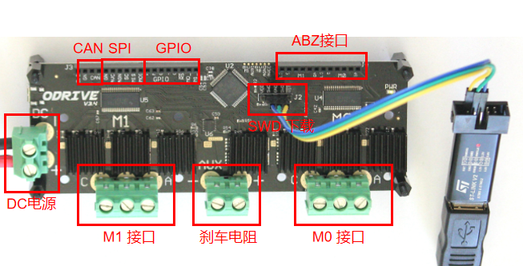
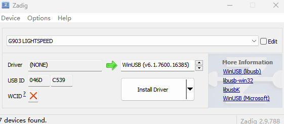
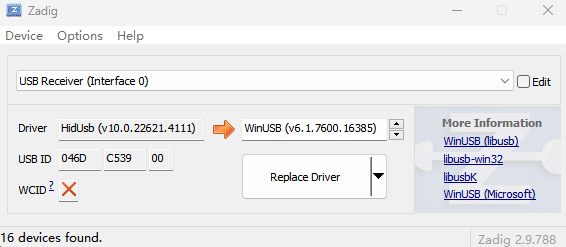
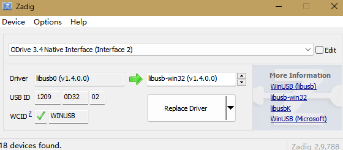
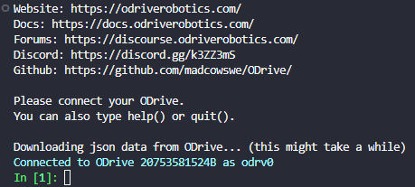

# Engine 5.1.1 Odrive环境配置

> VESC被多用于电动滑板和冲浪板的项目，ODrive 更侧重在机器人方向。
>
> Odrive 官方教程：[地址](https://docs.odriverobotics.com/v/latest/guides/getting-started.html#wire-up-the-odrive)

## 1. Odrive 基础配置

### 硬件连接



> 如果可能，请先连接电源，然后再打开电源，以避免浪涌电流。 如果无法避免这种情况，那么插入电源连接器时出现小火花是正常的，这是由电容器充电引起的。

> ODrive 的当前状态可以通过 LED 的颜色来观察：
>
> - `blue/teal`：ODrive 处于空闲状态。它不会移动，也没有错误。
> - `green`：ODrive 处于活动状态且正在运行。
> - `red`：发生错误，ODrive 已禁用。有关更多信息，请参阅故障排除页面。

### 固件下载

- 电脑安装 Python 环境，在 Python 环境下安装 `odrivetool` 包。

  ```shell
  $ pip install odrive==0.5.1.post0
  ```

- USB接口连到电脑上，电源接口接电源。

- `zadig` 下载固件：https://zadig.akeo.ie/ 

  1. 打开软件：

     

  2. 点击 `options` -> `list all device`：

     

  3. 选择 `odrive 3.6 native interface`

     

  4. `Replace Driver`

  5. 关掉 `zadig`，打开终端，输入 `odrivetool` ，出现蓝色字体说明连接成功。

     

     

