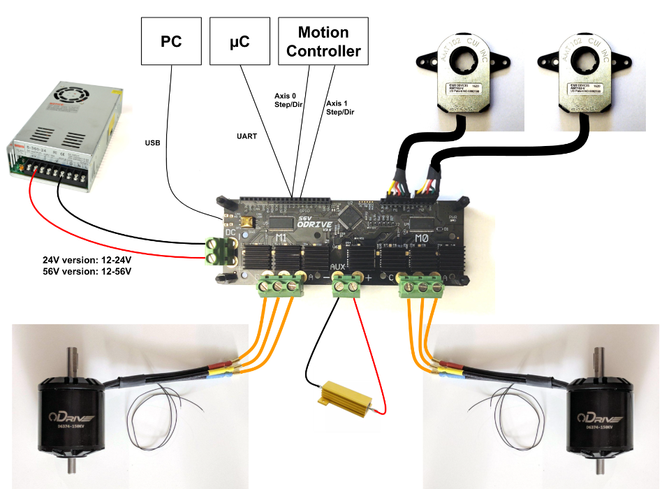

# Engine 5.1.2 Odrive电机控制

## 1. 硬件连接

1. 将三根电机线连接到 ODrive 螺钉端子中。 （不建议使用鳄鱼夹之类的夹式连接器，因为这会引起相电阻/电感测量问题）
2. 将编码器连接到 J4 端子。A，B相是必需的，Z（索引脉冲）是可选的。 ODrive 的 A，B，Z 输入内部集成了 3.3k 上拉电阻，用于开漏输出型编码器的输入。对于具有弱驱动电流（< 4mA）的单端推挽信号，您可能需要自行去掉 ODrive 上的上拉电阻（它们分别对应 M0 的丝印 R12、R13、R14 和对应 M1 的丝印 R9、R10、R11）。
3. 可以选用耗散电阻接入 AUX 接口。
4. 安全的接通电源。在给 ODrive 通电之前考虑一下一旦上电电机立即开始旋转会不会造成什么影响。
5. 将电源正负极连接到 ODrive 的 DC 端子。 注意正负极不要接错。 连接时产生的小火花是正常的，这是由于电容充电引起的。
6. ODrive 不通过 USB 端口供电，因此即使仅使用 USB 和 ODrive 通信也需要接入 24/56 伏电源进行供电。USB 线可以在通电之前或之后连接都可以。



## 2. 参数配置

<font color=LightGreen>1. 恢复默认值</font>

```python
odrv0.erase_configuration() 
```

<font color=LightGreen>2. 主板参数配置</font>

注意供电电源提供的电压和电流：

```python
odrv0.config.brake_resistance = 2.0                 		   # 配置耗散电阻(如果有,没有填0)
odrv0.config.dc_bus_undervoltage_trip_level = 8.0               # 配置低压保护阈值(取合理值)
odrv0.config.dc_bus_overvoltage_trip_level = 56.0               # 配置过压保护阈值(取电源电压以上10%的值)
odrv0.config.dc_max_positive_current = 30.0                	    # 配置过流保护阈值   
odrv0.config.dc_max_negative_current = -5.0                     # 配置反向过流保护阈值
odrv0.config.max_regen_current = 0                              # 配置回充电流值
odrv0.save_configuration()
```

<font color=LightGreen>3. 电机参数配置</font>

```python
odrv0.axis0.motor.config.pole_pairs = 15                    	# 配置极对数
odrv0.axis0.motor.config.calibration_current = 10               # 配置电机校准时的电流(不宜过大)
odrv0.axis0.motor.config.resistance_calib_max_voltage = 5       # 配置电机校准时的电压
odrv0.axis0.motor.config.motor_type = MOTOR_TYPE_HIGH_CURRENT   # 配置为大电流电机
odrv0.axis0.motor.config.current_lim = 20                   	# 配置电机运行的最大电流限制
odrv0.axis0.motor.config.requested_current_range = 30           # 配置电机电流采样范围
odrv0.save_configuration()
```

> **电机类型选择**：
>
> 1. 如果100毫安的电流噪声很小，则可以选择 `MOTOR_TYPE_HIGH_CURRENT`。
> 2. 如果100毫安的电流噪声很大，并且您的应用不需要电机快速旋转（$ΩL << R$），并且电机的相电阻相当大（1 ohm或更大），则应当选择`MOTOR_TYPE_GIMBAL`。
> 3. 如果100毫安的电流噪声很大，并且您的应用需要电机高速旋转，则需要更换 ODrive 上的电流采样电阻为更大值，使之能采集到相对较低的电流。
>
> **不要把非小电流云台电机配置为 `MOTOR_TYPE_GIMBAL` ，这样可能会使电机或 ODrive 过热。**

<font color=LightGreen>4. 编码器参数配置</font>

```python
odrv0.axis0.encoder.config.mode = ENCODER_MODE_HALL         	# 配置为霍尔编码器
odrv0.axis0.encoder.config.cpr = 90                 		    # 配置编码器分辨率(编码器手册说明)
odrv0.axis0.encoder.config.bandwidth = 100                       # 配置编码带宽
odrv0.save_configuration()
```

<font color=LightGreen>5. 控制器参数配置</font>

```python
odrv0.axis0.controller.config.control_mode = CONTROL_MODE_POSITION_CONTROL   # 位置环控制模式
odrv0.axis0.controller.config.vel_limit = 20                        		# 电机最大转速
odrv0.axis0.controller.config.pos_gain = 3                      			# 位置环增益，如果电机抖动可以适当调整该值
odrv0.axis0.controller.config.vel_gain = 0.2                    			# 速度环增益（在位置环可不配置）
odrv0.axis0.controller.config.vel_integrator_gain = 0.1             		# 速度环增益
odrv0.axis0.controller.config.input_mode = INPUT_MODE_TRAP_TRAJ         	 # 配置为梯形轨迹模式
odrv0.axis0.trap_traj.config.vel_limit = 10                     			# 配置梯形模式电机最大转速
odrv0.axis0.trap_traj.config.accel_limit = 2
odrv0.axis0.trap_traj.config.decel_limit = 2
odrv0.save_configuration()
odrv0.reboot()
```

## 3. 电机运行

首先进行电机校准。

```python
odrv0.axis0.requested_state = AXIS_STATE_FULL_CALIBRATION_SEQUENCE          	# 电机校准(会有一声提示音,然后电机正转反转)
odrv0.axis0.motor.config.pre_calibrated = True      				           # 校准结束
```

注意：必须运行校准后才能进行闭环控制。

```python
odrv0.axis0.requested_state = AXIS_STATE_CLOSED_LOOP_CONTROL            		# 进入闭环
odrv0.axis0.controller.input_pos = 50
odrv0.axis0.controller.input_pos = 0
```

### 无感控制指令

```python
#恢复默认参数
odrv0.erase_configuration()
 
#控制器参数配置
odrv0.axis0.controller.config.vel_gain = 0.01
odrv0.axis0.controller.config.vel_integrator_gain = 0.05
odrv0.axis0.controller.config.control_mode = CONTROL_MODE_VELOCITY_CONTROL  			# 无传感器控制模式，只能在速度控制模式下运行。
odrv0.axis0.controller.input_vel = 10
odrv0.axis0.controller.config.vel_limit = 50
 
#电机参数配置
odrv0.axis0.motor.config.current_lim =15
odrv0.axis0.motor.config.direction = 1                                           		# 设置电机定向转动。
odrv0.axis0.sensorless_estimator.config.pm_flux_linkage = 5.51328895422 / (7 * 980)      # 永磁磁链配置，电机极对数*电机KV。
odrv0.axis0.requested_state = AXIS_STATE_MOTOR_CALIBRATION          				   # 校准电机，2S后会听见滴声。
odrv0.axis0.motor.config.pre_calibrated = True                  					   # 设置重启也有效。
odrv0.axis0.requested_state = AXIS_STATE_SENSORLESS_CONTROL         				   # 进入无传感器控制模式。
odrv0.axis0.config.startup_sensorless_control = True                    				# 重启也有效。
odrv0.save_configuration()
odrv0.reboot()
 
#重启后电机会定向转动校准位置
 
 
#电机控制测试
odrv0.axis0.controller.input_vel = 10       #设置电机转动速度为10
odrv0.axis0.controller.input_vel = -10      #设置电机转动速度为-10
```

