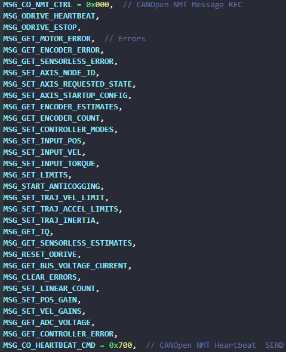

# Engine 5.3.1 Odrive的CAN通信

ODrive的CAN通信采用标准帧格式，也就是11 bit。`Address = node_ID | cmd_ID`。

> 1. 节点ID（`node_ID`）为高 6 位，设置范围`0 `— `0x3F`，一个 `ODrive` 的 M0/M1需设置为不同的 `node_ID`。
> 2. 命令ID（`cmd_ID`）为低 5 位。
>
> `msgID = (node_ID<<5) | cmd_ID` 为发送指令。

目前存在以下指令：



ODrive 默认 CAN 通信 ID 为 0，默认波特率为 250K。上电后 CAN 接口以 0.1 秒为周期发送心跳包。

在 ODrive 中数据帧为控制指令，远程帧为请求返回数据（比如编码器计数，电压，电流等等）

- Odrive CAN通信设置

```python
odrv0.axis0.config.can.node_id = 2   # ID=2
odrv0.can.set_baud_rate(250000)      # 设置波特率250K
odrv0.save_configuration()
odrv0.reboot()
```

