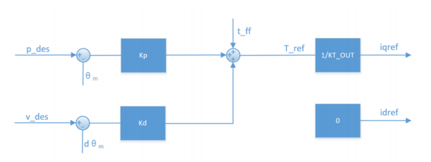

# Engine 6.1 关节电机的MIT控制模式

传统的 PMSM 是通过串级 PID 进行控制，在 Unitree/DAMIAO 电机中，使用的是由 MIT 提出的 MIT 控制模式：

 

MIT 模式可实现力矩、位置、速度三者混合控制，位置环与速度环是并联形式，置环与速度环的输出值与前馈力矩 $t_{ff}$ 相加得到参考力矩 $T_{ref}$ ：
$$
T_{ref} = K_p(\theta-\theta_m)+K_d(ω-\omega_m)+t_{ff}
$$
$K_p$ 为位置增益（刚度系数），$K_d$ 为速度增益（阻尼系数）。力矩，速度，位置均为电机轴输出量，安装减速器时要对应换算。

1. 当 $K_p=0，K_d≠0$ 时，给定 $\omega$ 即可实现匀速转动。匀速转动过程中存在静差，另外 $K_d$ 不宜过大， $K_d$ 过大时会引起震荡。
2. 当 $K_p=0，K_d=0$，给定 $t_{ff}$ 即可实现给定扭矩输出。在该情况下，电机会持续输出一个恒定力矩。但是当电机空转或负载较小时，如果给定  $t_{ff}$ 较大，电机会持续加速，直到最大速度，这时也仍然达不到目标力矩  $t_{ff}$ 。
3. 当 $K_p≠0，K_d=0$ 时，会引起震荡。即对位置进行控制时，$K_d$ 不能赋 0，否则会造成电机震荡，甚至失控。
4. 当 $K_p≠0，K_d≠0$ 时，当期望位置为常量，期望速度为 0 时，可实现定点控制；当期望位置是随时间变化的连续可导函数时，同时期望速度是期望位置的导数，可实现位置跟踪和速度跟踪，即按照期望速度旋转期望角度。

当电机带有负载时，需要加入前馈力矩进行补偿（尤其是重力负载）。
