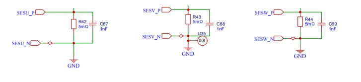

# STM32 电机驱动 4-2 BLDC电机闭环驱动

## 1. 电压电流采样（STM32G4）

### ADC（电源电压采样）

首先使用规则组进行电源的电压采样，见STM32_Basic的ADC篇即可。

**注入组用于采集相电流，规则组为其他ADC通道转换**。

### OPAMP 内置运算放大器 + ADC（三相电流采样）

STM32G4 系列内置运算放大器可以用于模拟信号的放大。使用`HAL_OPAMP_Start()`打开运放，运放可以配合ADC进行使用。




> - 1.5kΩ 电阻是为了输入的正向端和负向端输入阻抗匹配；
> - 22kΩ 为分压电阻，作用是将输入正向端电压正向偏置 1.65V；
> - 11kΩ 为负反馈电路。
>
> 电流计算公式：
> $$
> I_{in} = \frac{ADC\_Value \times 3.3}{4096 \times R_{42} \times (1+\frac{R_{56}}{R_{59}})}
> $$
>
> ```c
> void HAL_ADCEx_InjectedConvCpltCallback(ADC_HandleTypeDef *hadc)
> {
>     if (hadc == &hadc1) {
>         temp[2] = hadc1.Instance->JDR1;
>         temp[2] = (temp[2] - 0x7ef) * 0.0193359375f; // 0.193359375为运放增益，7ef，7f5，7e8为运放直流偏置
>         temp[3] = hadc1.Instance->JDR2;
>         temp[3] = (temp[3] - 0x7f5) * 0.0193359375f;
>     } else if (hadc == &hadc2) {
>         temp[4] = hadc2.Instance->JDR1;
>         temp[4] = (temp[4] - 0x7e8) * 0.0193359375f;
>     }
> }
> ```

