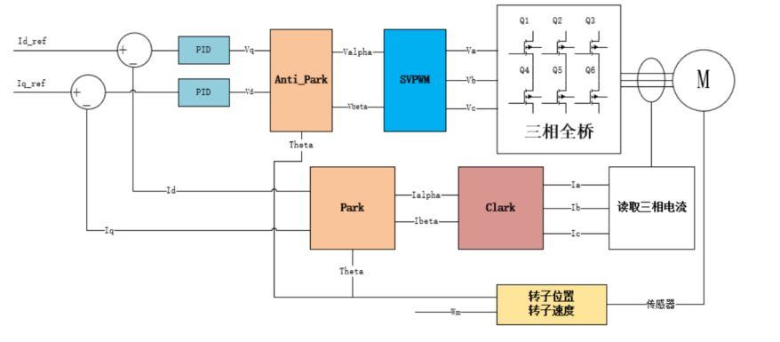
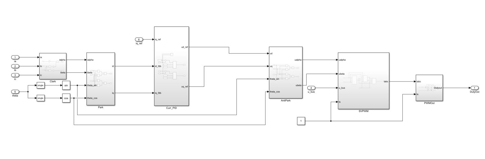
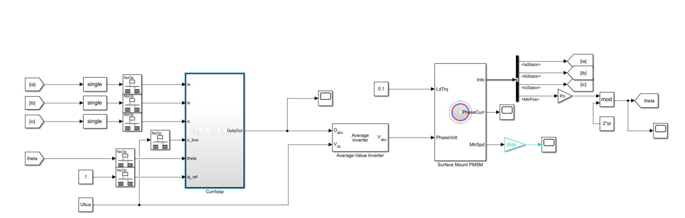
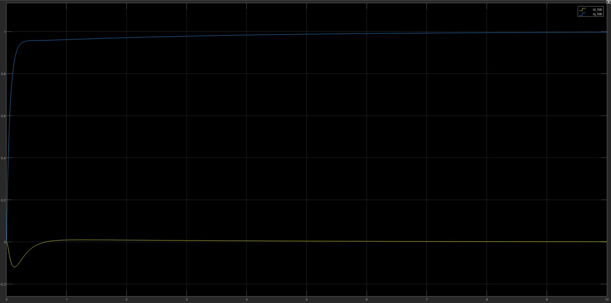
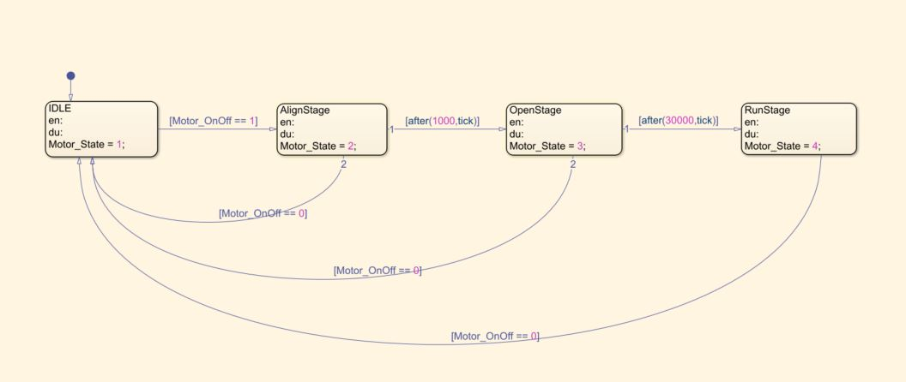
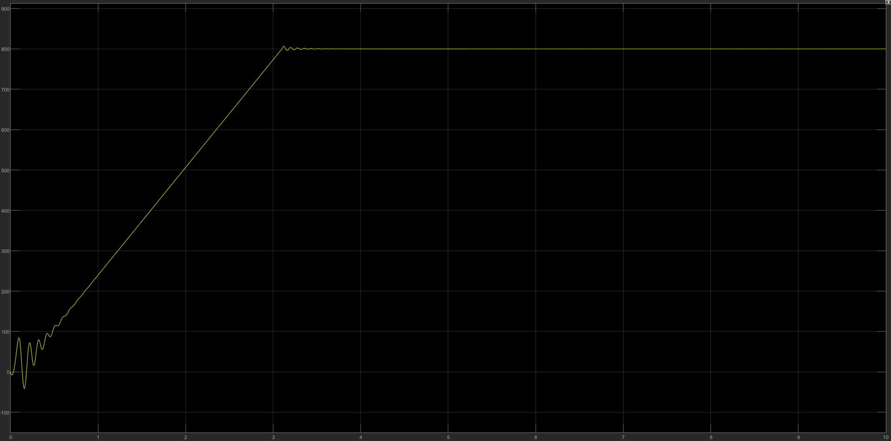
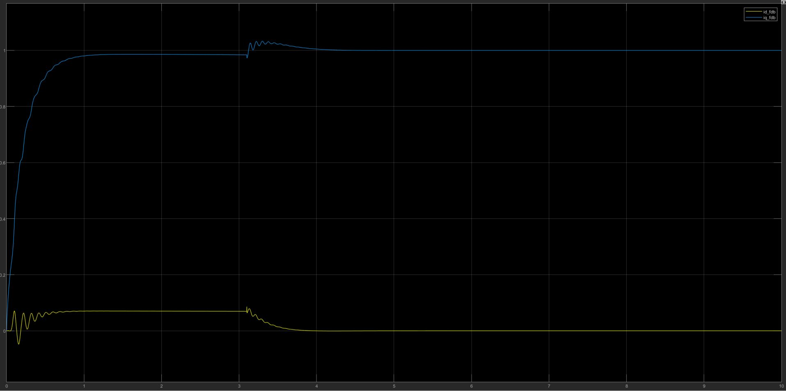

# STM32 电机驱动 4-5 FOC闭环驱动

## 1. FOC电流环

FOC电流环作用如下：

>（1）$I_d$保持为0，提高效率；
>
> 使用电压开环控制时，由于种种原因，$I_d$并不是一直为0，可能存在偏移或是跳动，转速越高这种情况就越厉害，而使用电流闭环可以较好地遏制这种现象。
>
>（2）限流保护；
>
> 硬件上的过流保护只是作为最后一道保护措施，真正的限流通常是由软件上的电流环来实现。将电机的电流限死在额定电流之下，这样即使电机堵转也不用担心烧毁电机或是驱动器。
>
>（3）电流环控制就是力矩环控制；

### Simulink FOC电流环建模

按照以上流程图进行建模，通过以下模型验证给定参数是否使得系统收敛。

$I_d$，$I_q$仿真结果如下：

模型是收敛的。

### IF 模式

IF 模式是速度环开环，电流环闭环的模式来启动电机，FOC电流环控制模型中的 theta 角度来自电机输出的角度，但是在电机系统中，通常不会有角度输出，故在未加入位置传感器的条件下，角度需要自行生成（速度开环）。

IF启动分为转子定位，开环拉起，电流环运行三个过程。

状态机分为四个状态：

> 1. 空闲：输出电机的参考角度为0和q轴参考电流为0；
> 2. 角度校准：输出的 theta 角度需要为 0，q 轴参考电流有给一个能够驱动电机转动的电流；
> 3. 开环拉起：通过开环速度和开环时间得到开环角度值，使得转速能够迅速上拉；
> 4. 电流环闭环运行：将拉起后的速度进行积分得到当前角度，由电流环实现控制。（此时速度会稍微抖动）

IF控制仿真结果如下：

