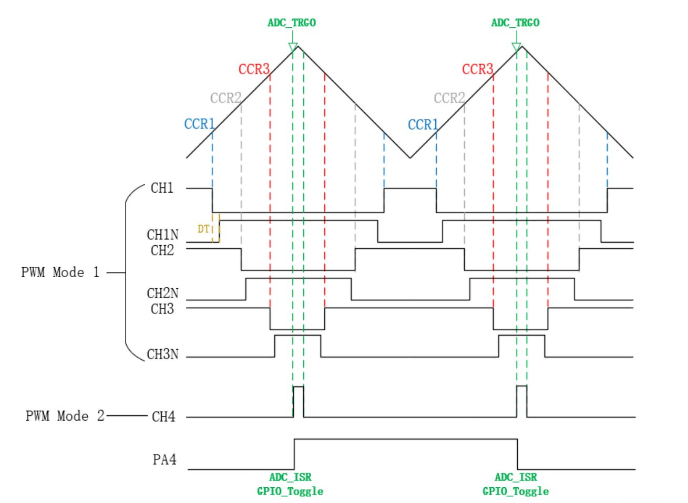
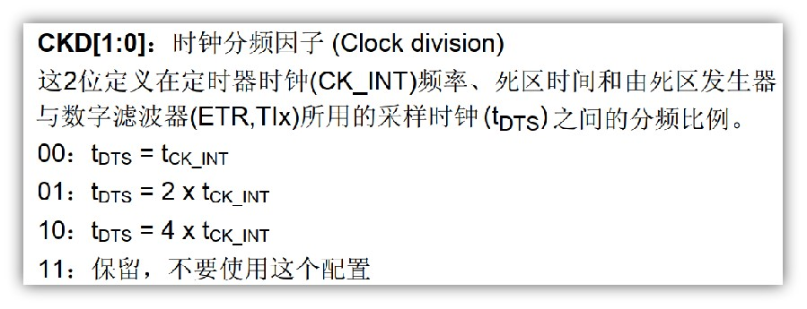
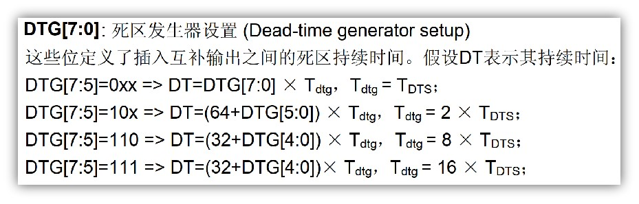
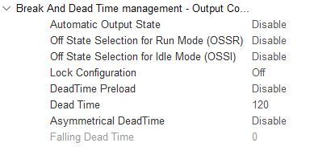
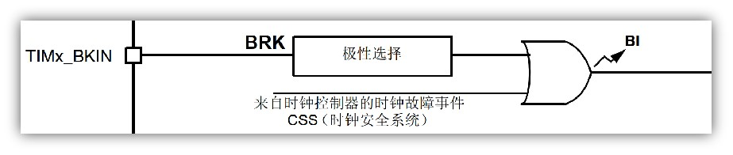
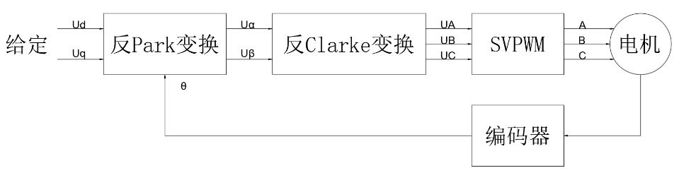

# STM32 电机驱动 4-4 PMSM电机的VF驱动

## 1. STM32高级定时器



### PWM互补输出

通常的，为了能够使用七段式SVPWM，通常使用STM32定时器的中心对齐模式PWM。同时，为了使得PWM只在一个半桥臂导通，使用STM32的互补输出。

```c
/**
  * @brief 互补通道输出函数
  * @param htim 定时器句柄
  * @param Channel 通道数
  */
HAL_StatusTypeDef HAL_TIMEx_PWMN_Start(TIM_HandleTypeDef *htim, uint32_t Channel);
```

### 死区配置

为了使得两个半桥臂不会同时导通，通常配置死区时间。

1. 确定$t_{DTS}$：

$$
f_{DTS} = \frac{f_t}{2 \times CKD[1:0]}
$$



2. 输入$DTS[7:5]$，选择计算公式：





### 刹车信号



使能刹车功能：将`TIMx_BDTR`的`BKE`位置1，刹车输入信号极性由`BKP`位设置。

使能刹车功能后：由`TIMx_BDTR`的`MOE`、`OSSI`、`OSSR`位，`TIMx_CR2`的`OISx`、`OISxN`位，`TIMx_CCER`的`CCxE`、`CCxNE`位控制`OCx`和`OCxN`输出状态无论何时，`OCx`和`OCxN`输出都不能同时处在有效电平。

### TIM 触发 ADC 转换

使用TIM触发ADC转换，一般的，应在发波中点时进行电流采样。

## 2. PMSM开环驱动



开环驱动PMSM时，输入指定的$U_q$和$U_d$，从而使得电机转动。

使用AntiPark和SVPWM模块，以$U_q$，$U_d$，$f$为输入，三通道占空比为输出。在TIM规定的ADC触发中断中进行步进。

