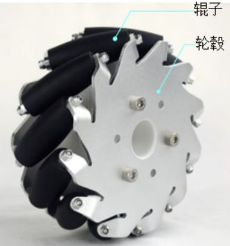
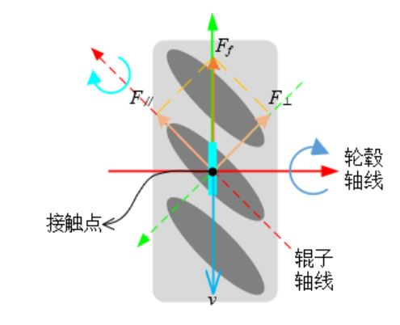
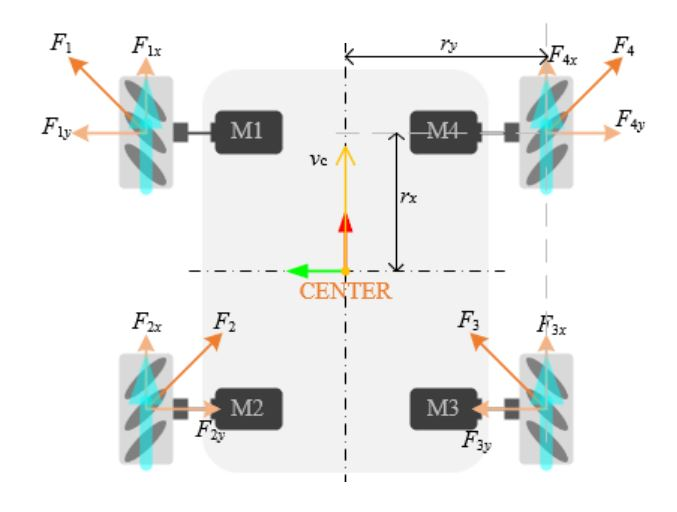
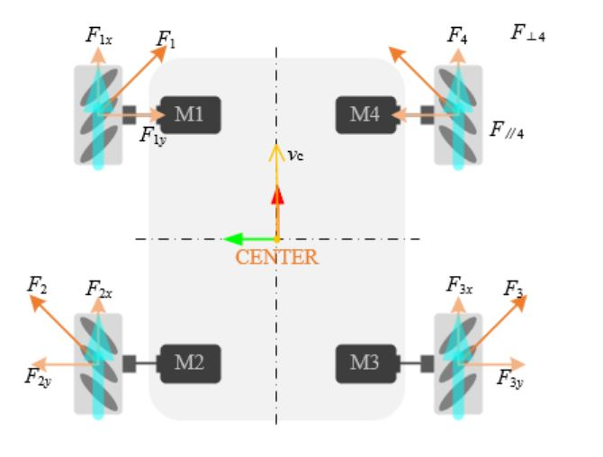
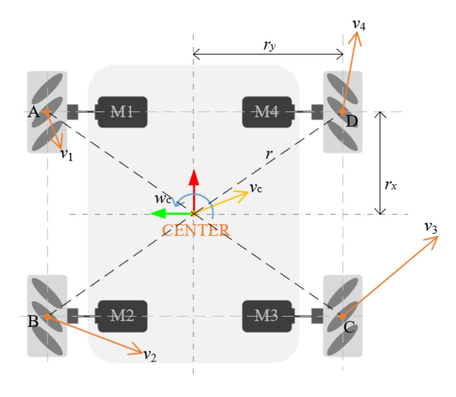

# STM32 电机控制 底盘模型 1_麦克纳姆轮四轮模型

## 1. 麦克纳姆轮简介

麦轮由轮毂和辊子组成：轮毂是整个轮子的主体支架，辊子则是安装在轮毂上的鼓状物（小轮），两者组成一个完整的大轮。

轮毂轴线与辊子转轴夹角呈45度，理论上该夹角可为任意值，但市面上主流为45度。为满足该几何关系，轮毂边缘采用了折弯工艺，可为辊子的转轴提供安装孔，因此辊子是被动轮。

### 单个麦克纳姆轮的受力分析

麦轮外围的辊子是与地面接触的，当麦轮绕轮毂轴转动时，辊子会与地面产生摩擦力$F_f$，其作用力方向为轮毂坐标系y轴正方向。

将地面摩擦力$F_f$沿着垂直和平行于辊子轴线方向进行力分解，由于辊子是被动轮，因此会受到垂直于轮毂轴线的分力$F_⊥$作用而被动转动，也说明分力$F_⊥$是滚动摩擦力，对辊子的磨损较大；平行于轮毂轴线的分力$F_∥$也会迫使辊子运动，只不过是主动运动（辊子被轴线两侧轮毂机械限位），所以分力$F_∥$是静摩擦。

电机输入轮毂的扭矩，一部分被辊子自转“浪费掉”，另一部分形成静摩擦驱动麦轮整体运动；单个麦轮实际的（受力）运动方向为辊子轴向方向，因此改变辊子轴线和轮毂轴线的夹角，就可以改变麦轮实际的（受力）运动方向。

### 麦克纳姆轮底盘的受力分析

根据麦轮受力特点，因此有着多种构型的麦轮平台。麦轮平台构型是有规律的：**两前轮和两后轮关于横向中轴线上下对称，两左侧轮和两右侧轮关于纵向中轴线左右对称。**

将麦轮按照一定排布方式进行配置，就组合为经典的麦轮平台，以机器人几何中心为原点建立坐标系，前向运动方向为x轴正方向（红色箭头），与之垂直向左为y轴正方向（绿色箭头），z轴垂直于纸面向外，满足右手定则。

麦轮平台是全向移动机器人的原因是其有三个自由度，意味着可以在平面内做出任意方向平移同时自旋的动作。
采用任意方向的线速度及角速度$[v_c\quad  w]^T$来描述CENTER的速度，而vc可沿着坐标轴分解为两个分速度，表示为$[v_{cx} \quad v_{cy} \quad w]^T$。

1. 纵向直线运动

当四个麦轮同向等速转动时，横向分力相互抵消，纵向分力形成合力，驱动麦轮平台向前，用数学公式表达为：

$$
\begin{cases}
F_{1y}+F_{4y} = 0 \\
F_{2y}+F_{3y} = 0 \\
F_{\Sigma x} = F_{1x} + F_{2x} + F_{3x} + F_{4x}
\end{cases}\tag{1}
$$

四个麦轮同向等速转动时，麦轮平台做前进/后退的纵向直线运动。

2. 斜向运动

当左后轮和右前轮前向转动，且右后轮和左前轮不转动时，仅有斜向力$[ F_2\quad F_4]$，且二者方向平行，形成的合力驱动麦轮平台斜向左上运动；若左后轮和右前轮后向转动，形成反向合力，驱动麦轮平台斜向右下运动；若右前轮和左后轮不转动，左前轮和右后轮前向转动，则合力驱动麦轮平台斜向右上运动，若左前轮和右后轮后向转动，则合力驱动麦轮平台斜向左下运动。 

3. 自旋运动

认为四边形ABCD为普通矩形，这就需要对四个麦轮作用力$[F1 \quad  F2 \quad  F3 \quad  F4]$做分解,对角的两个麦轮作用力（$[F1 \quad F3]$和$[F2 \quad F4]$）方向平行反向，大小相等；左前轮和右后轮的径向分力相互抵消，右前轮和左后轮的径向分力相互抵消；而剩下的四个麦轮作用力的切向分力，大小相同，且均为顺时针方向，则形成合力驱动麦轮平台顺时针旋转。同样的分析，当四个麦轮转向均反向，则麦轮平台逆时针旋转。 

## 2. 麦克纳姆轮运动学分析

已知点CENTER速度$[v_c \quad w_c]^T$，需要分解到各个麦轮上，采用平面刚体运动规律分析方法，单个麦轮的速度是由点CENTER速度及角速度共同作用合成的，可表示为

$$
v_i = v_c + \omega_c × r_i
$$

$$
\left[\begin{matrix}
v_{ix} \\
v_{iy}
\end{matrix}\right] = 
\left[
    \begin{matrix}
    v_{cx} + \omega_cr_y \\
    v_{cy} + \omega_cr_x
    \end{matrix}
\right]
$$
将$v_i$沿着辊子轴线分解，有
$$
v_{∥i} = \frac{\sqrt 2}{2}v_{cx} + \frac{\sqrt 2}{2}v_{cy} + \frac{\sqrt 2}{2}\omega_c(r_x+r_y)
$$
同时，对于电机转速，有
$$
v_{∥i} = \omega_iRcos(45°)
$$
以此类推可得正运动学方程：
$$
\left[\begin{matrix}
v_{cx}\\
v_{cy}\\
\omega_c
\end{matrix}\right] = \frac{R}{4}
\left[
    \begin{matrix}
    1 & 1 & 1 & 1\\
    -1 & 1 & -1 & 1\\
    \frac{-1}{r_x+r_y} &\frac{-1}{r_x+r_y} & \frac{1}{r_x+r_y} & \frac{1}{r_x+r_y}
    \end{matrix}
\right]
\left[
    \begin{matrix}
    \omega_1 \\
    \omega_2 \\
    \omega_3 \\
    \omega_4 
    \end{matrix}
\right]
$$

逆运动学方程

$$
\left[\begin{matrix}
    \omega_1 \\
    \omega_2 \\
    \omega_3 \\
    \omega_4 
\end{matrix}\right] = \frac{1}{R}
\left[
    \begin{matrix}
        1 & -1 & -(r_x+r_y) \\
        1 & 1 & -(r_x+r_y) \\
        1 & -1 & (r_x+r_y) \\
        1 & 1 & (r_x+r_y) \\
    \end{matrix}
\right]
\left[
    \begin{matrix}
v_{cx}\\
v_{cy}\\
\omega_c
    \end{matrix}
\right]
$$