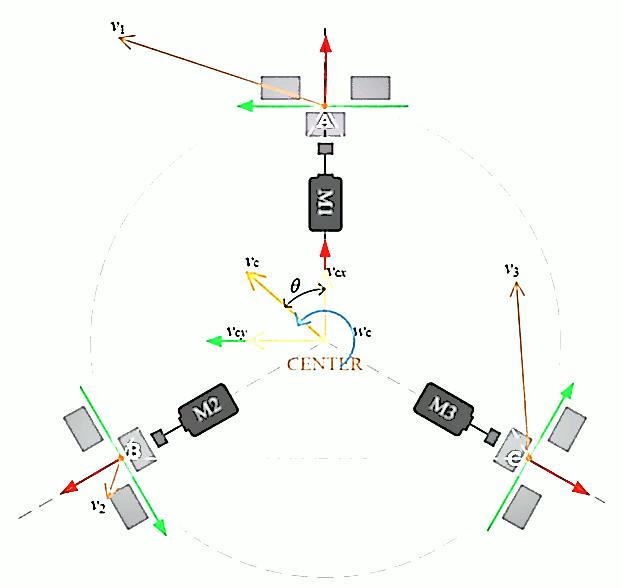
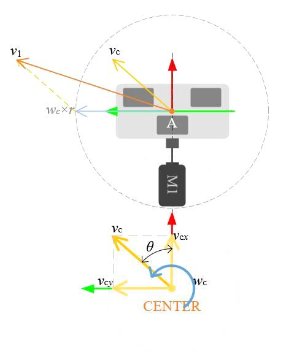
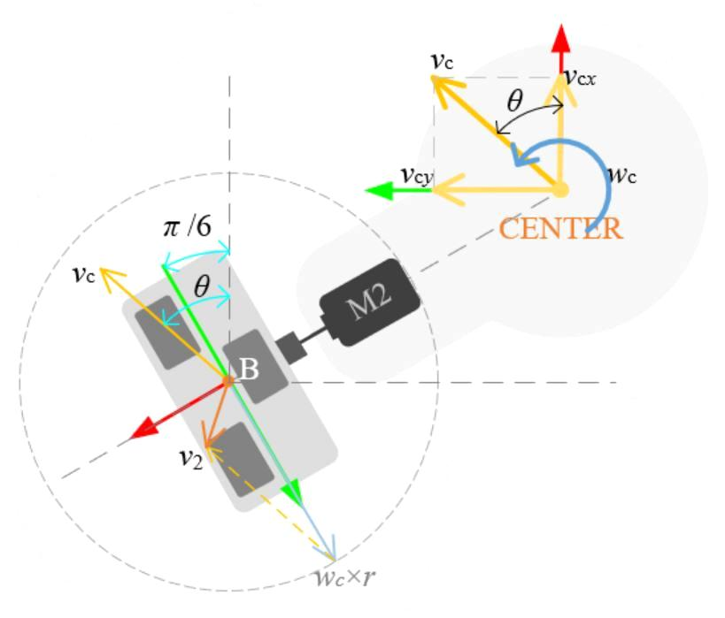

# STM32 电机控制 底盘模型 2_全向轮三轮模型

[全向轮机器人运动模型及应用分析 (qq.com)](https://mp.weixin.qq.com/s/d6EKLlen4gF8Eoat8eSFvQ)

## 1. 全向轮简介

全向轮特有的运动模式决定了全向轮移动机器人的构型。常见的构型分为三轮构型和四轮构型两种，三轮构型仅使用三个电机，且不需要使用悬挂（三点决定一个平面），其结构较为简单；四轮构型使用四个电机，需要使用悬挂，但运动稳定性更好。 

## 2. 全向轮三轮运动学分析

在对全向轮移动平台运动规律分析之前需要做两个基本假设：

> - 全向轮平台运动过程中，轮子不会悬空而发生空转现象；
> - 全向轮平台质量分布均匀，且质心位置在点CENTER处，以保证三（或四）个轮子在地面接触点受到的支撑力相同，确保三（或四）个等转速的轮子受到地面作用的摩擦力大小相同。 

**前向直线运动**：M1电机静止，M2轮逆时针运动，M3轮顺时针运动，且M2和M3轮运动速度大小相同， M2轮和M3轮的速度方向也是其静摩擦力方向，摩擦力大小相等，方向关于全向轮平台CENTER坐标系的x轴对称。因此，M2轮和M3轮的静摩擦力在CENTER坐标系的*y*轴上的投影分量大小相等，方向相反，则相互抵消；而M2轮和M3轮的静摩擦力在CENTER坐标系的x轴上的投影分量大小相同，方向相同，则相互叠加，且与M1轮的辊子滚动方向一致（不会产生静摩擦阻力），则可驱动全向平台前向运动。M2轮和M3轮反向转动，则可驱动全向平台后向运动。 

**左向直线运动**：需要控制三个全向轮同时按照一定速度运动。这里只定性分析关系，由电机驱动全向轮转动产生的速度总是沿着轮毂径向（即圆ABC的切线方向），只是最终实际合成的运动速度会因为速度叠加的关系而发生变化。 

M1轮正转，M2轮反转，M3轮反转，对应着M2轮和M3轮速度在CENTER坐标系的*x*轴上的投影分量大小相等，方向相反，则相互抵消；而M2轮和M3轮速度在CENTER坐标系的*y*轴上的投影分量大小相同，方向相同，则相互叠加，且叠加后的方向与M1轮速度方向一致，形成进一步叠加。因此，若三个轮子反向转动而合成的运动为右向直线运动。 

需要注意的是还需要抵消掉旋转运动。M2轮和M3轮产生的速度有促使全向轮平台绕CENTER坐标系*z*轴顺时针方向转动的趋势，而M1轮则促使全向轮平台逆时针转动，因此需要调节三个全向轮的转速大小，将旋转运动平衡掉。 

**逆时针自旋运动**：所有全向轮均正转，即所有全向轮的速度方向均沿着圆ABC的切线方向，且朝向逆时针方向。若将三个全向轮的速度矢量$[v_1 v_2 v_3]$的起始点平移至点CENTER，那么三个速度矢量的夹角为120度，且速度大小相等，因此三个速度矢量合成为零向量，因此全向轮平台不会移动。 

- 单轮解析

1. M1 轮

将点A的合速度沿着坐标系$xAy$分解，表示为
$$
\left[
\begin{matrix}
v_{1x} \\
v_{1y}
\end{matrix}
\right] =
\left[
\begin{matrix}
v_{cx} \\
v_{cy} + \omega_cr
\end{matrix}
\right]
$$
式中，$\left[\begin{matrix}v_{1x} & v_{1y}\end{matrix}\right]^T$表示$v_1$在坐标系$xAy$的分速度，$\left[\begin{matrix}v_{cx} & v_{cy}\end{matrix}\right]^T$表示$v_c$的分速度，$r$表示的点A到点CENTER的距离。

故有
$$
\left[
\begin{matrix}
v_{⊥1} \\
v_{||1}
\end{matrix}
\right]
=
\left[
\begin{matrix}
v_{1x} \\
v_{1y}
\end{matrix}
\right] =
\left[
\begin{matrix}
v_{cx} \\
v_{cy} + \omega_cr
\end{matrix}
\right]
$$
纵向分速度是由电机转动产生，进而可表示为
$$
\omega_1 = \frac{v_csin\theta + \omega_cr}{R}
$$

2. M2 轮

由于M2轮在CENTER坐标系的方位角为120度，因此坐标系$xBy$的$y$轴线与CENTER坐标系$x$轴线的（两直线）夹角为$\frac{π}{6}$，因此在坐标系$xBy$中，矢量$v_c$*与*$x$轴的夹角可表示为$\theta - \frac{2\pi}{3}$。

因此，$v_2$沿坐标系$xBy$分解后表示为
$$
\left[
\begin{matrix}
v_{⊥2} \\
v_{||2}
\end{matrix}
\right]
=
\left[
\begin{matrix}
v_{2x} \\
v_{2y}
\end{matrix}
\right] =
\left[
\begin{matrix}
v_{cx} \\
\omega_cr - v_csin(\theta - \frac{2\pi}{3})
\end{matrix}
\right]
$$
故有：
$$
\omega_2 = \frac{\omega_cr - v_c(\frac{1}{2}sin\theta + \frac{\sqrt3}{2}cos\theta)}{R}
$$

### 正运动学方程

$$
\left[
\begin{matrix}
\omega_1 \\
\omega_2 \\
\omega_3
\end{matrix}
\right] = \frac{1}{R}
\left[
\begin{matrix}
0 & 1 & r \\
-\frac{\sqrt3}{2} & -\frac{1}{2} & r \\
\frac{\sqrt3}{2} & -\frac{1}{2} & r
\end{matrix}
\right]
\left[
\begin{matrix}
v_{cx} \\
v_{cy} \\
\omega_c
\end{matrix}
\right]
$$

### 逆运动学方程

$$
\left[
\begin{matrix}
v_{cx} \\
v_{cy} \\
\omega_c
\end{matrix}
\right]
= R
\left[
\begin{matrix}
0 & -\frac{\sqrt3}{3} & \frac{\sqrt3}{3} \\
\frac{2}{3} & -\frac{1}{3} & -\frac{1}{3} \\
\frac{1}{3r} & \frac{1}{3r} & \frac{1}{3r}
\end{matrix}
\right]
\left[
\begin{matrix}
\omega_1 \\
\omega_2 \\
\omega_3
\end{matrix}
\right]
$$

