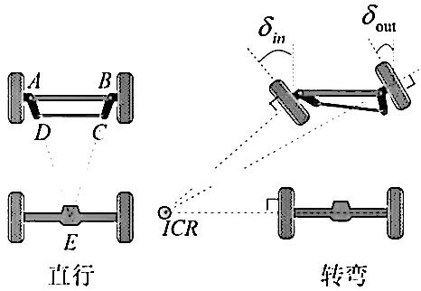
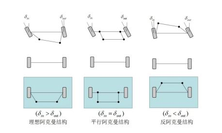
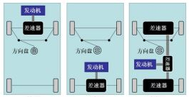
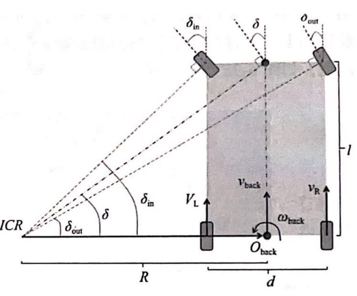

# STM32 电机控制 底盘模型 3_阿克曼转向模型

## 1. 阿克曼模型简介

四轮差速底盘有很好的载重和越野性能，但是转弯时轮子会发生一定程度的侧滑，在侧向滑动不明显的情况下，可以用两轮差速等效模型实现，但是仍然会使得底盘控制更加复杂。阿克曼底盘会在轮子不发生侧滑的条件下顺畅的进行转弯，但是存在不能原地旋转的缺点。

直线行驶时，四个车轮的轴线互相平行，转弯时，四个车轮应当只沿车轮切线方向运动而不发生滑移，以避免滑移对于轮胎产生的巨大磨损。此时四轮转弯弧线处于共同的圆心上，前轮内侧转向角$\delta_{in}$大于外侧转向角$\delta_{out}$，阿克曼结构中使用梯形四连杆的相等曲柄控制转向。常见的阿克曼机构如下图。

低速转弯时可以使用理想阿克曼机构，高速转弯时可以使用平行阿克曼机构。机器人常用的是理想阿克曼机构。

阿克曼底盘根据驱动方式的不同分为前驱，后驱和四驱。

## 2. 阿克曼模型速度解算

以后驱阿克曼底盘为例。

### 正向运动学方程

$$
\left[\begin{matrix}v_{back} \\ \omega_{back}\end{matrix}\right] = \left[\begin{matrix} \frac{1}{2} & \frac{1}{2} \\ -\frac{1}{d} & \frac{1}{d}\end{matrix}\right]\left[\begin{matrix}V_{L} \\ V_R\end{matrix}\right]
$$

### 逆向运动学方程

$$
\left[\begin{matrix}V_{L} \\ V_R\end{matrix}\right] = \left[\begin{matrix} 1 & -\frac{d}{2} \\ 1 & \frac{d}{2}\end{matrix}\right]\left[\begin{matrix}v_{back} \\ \omega_{back}\end{matrix}\right]
$$

前轮的转向角可以通过下式得到：
$$
tan\delta = \frac{l}{R}
$$
旋转半径可以通过下式得到：
$$
R = \frac{v_{back}}{\omega_{back}}
$$
舵机的控制量和$\delta$之间的关系通过实验得出。
