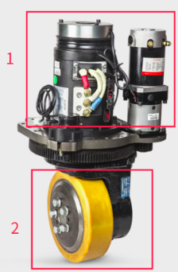
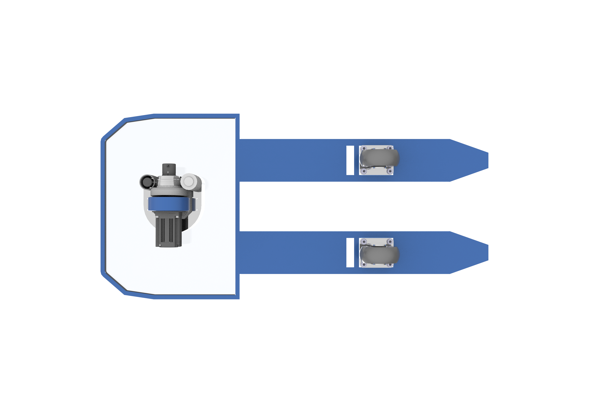
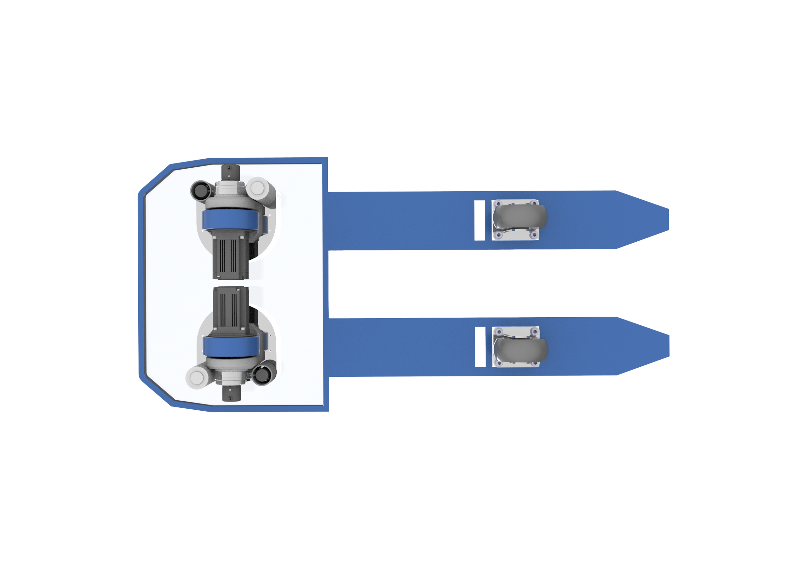
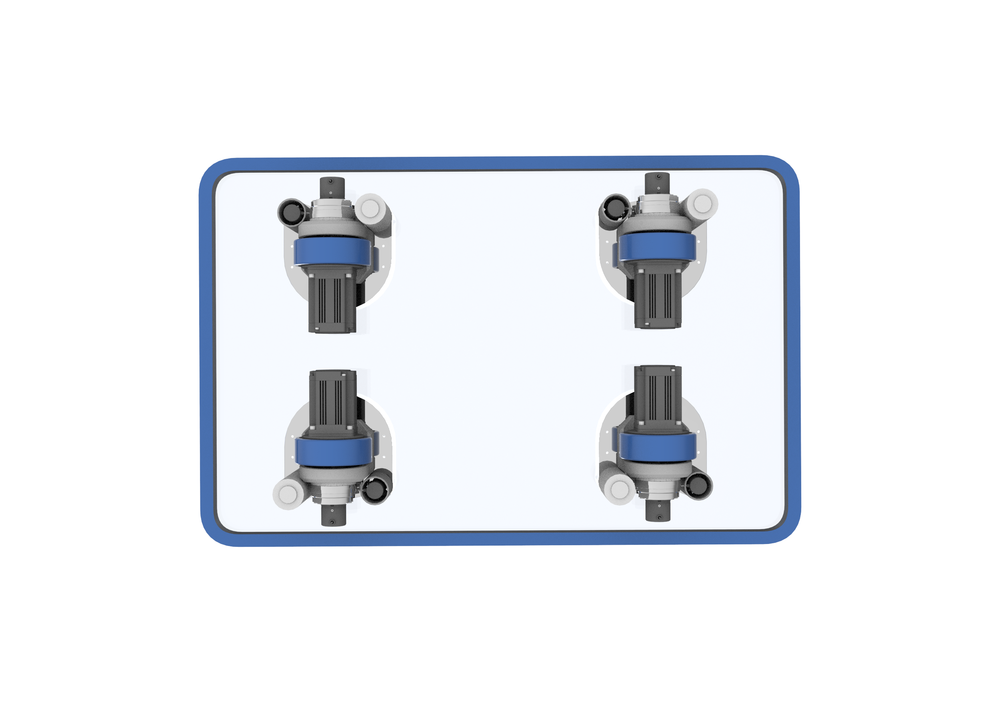
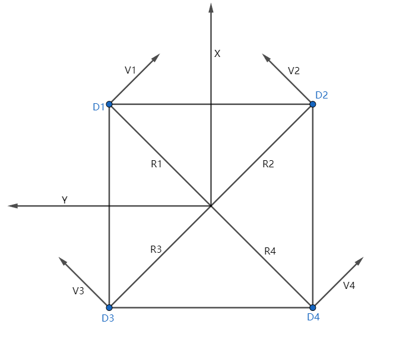
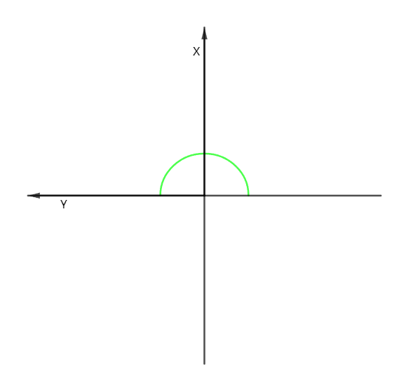
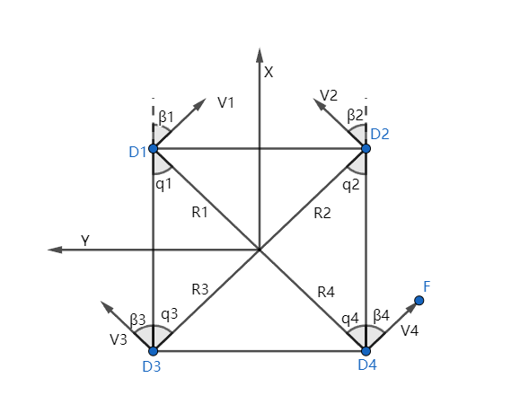
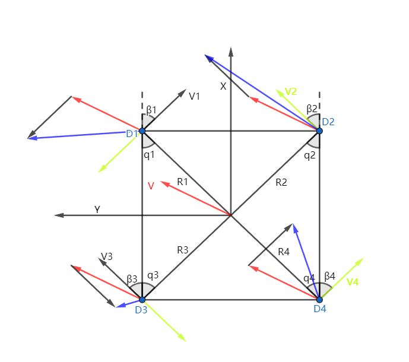

# STM32 电机控制 底盘模型 4_舵轮四轮模型

## 1. 舵轮简介

### 舵轮简介

舵轮由两个电机组成，一个电机控制车轮的转向（称为舵向），另一个电机控制车轮的速度，通常的，舵向电机要求力矩大，位置控制精确；前进方向电机要求力矩大，调速可以达到较为理想的阶跃响应。

### 常见舵轮底盘

1. 单舵轮

单舵轮结构是最简单的底盘结构之一，其底盘结构由1个舵轮、 2个定向轮组成，在叉车上面有着非常广泛的应用。单舵轮底盘结构可以直接适应各种地面，保证驱动舵轮一定着地。结构简单、成本低，由于是单轮驱动，无需考虑电机配合问题，适用于广泛的环境和场合。

2. 双舵轮底盘

双舵轮底盘结构是目前市场上最常见的结构之一，其底盘由两个驱动轮和一个或多个非驱动轮组成，通常应用于中等载重的AGV上。

3. 四舵轮底盘

四舵轮底盘结构是通过4个舵轮的转角及速度实现AGV的横向、斜向和原地旋转运动,成为了近年来重载移动机器人领域的研究热点。采用四舵轮底盘结构的AGV可以同时满足狭窄工作空间下的灵活性要求和车间复杂路面条件下的适用性要求。通常使用的是四舵轮AGV和三舵轮AGV。

## 2. 四舵轮底盘运动学分析

在对四轮AGV运动解算之前需要做以下假设：

> - 舵轮行进轮不会发生侧滑；
> - 舵轮平台质量分布均匀，四个舵轮的负载均匀。

机器人正方向规定如上图，X为车前，Y为车左侧，构成右手坐标系，底盘不完全为正方形。

R1，R2，R3，R4均能从机械装配给出（相对于全向轮和麦克纳姆轮测得参数更加准确）。

考虑到机械装配时的布线问题（不使用滑环时舵向不能无限旋转），同时考虑到舵向转换角度越小运行效率越高，故**限制每一个轮的舵向仅能在X轴正方向运动**。（下图中的绿色部分）

$q_1$，$q_2$，$q_3$，$q_4$可以通过几何关系求出。$\beta_1$，$\beta_2$，$\beta_3$，$\beta_4$为上述角度的余角，用来进行旋转速度的分解。

### 正运动学方程

如上图所示，将速度分解为平移速度和旋转速度，平移速度由X，Y方向平移速度进行合成（红色箭头），旋转速度给定（绿色箭头），通过速度合成可以得到每一个舵轮的方向和速度（蓝色箭头）。

**如果单个舵轮的速度矢量不符合舵向限制，进行角度归一化后同时将速度反向。**

**考虑到X方向速度为零时反三角函数解算无意义，故需要对X方向速度为0时进行方向特殊处理。**

### 逆运动学方程

由于旋转速度和平移速度分配到每一个轮上是存在几何约束的，逆运动学方程的意义不大，故不进行讨论。
