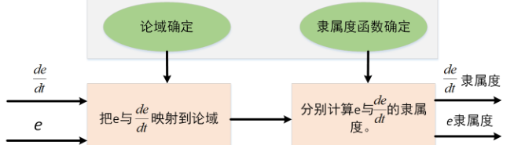
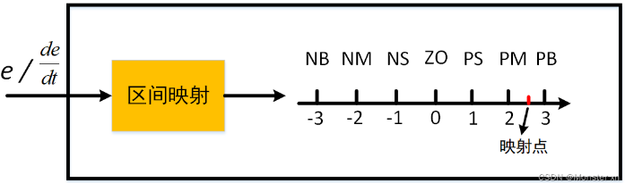
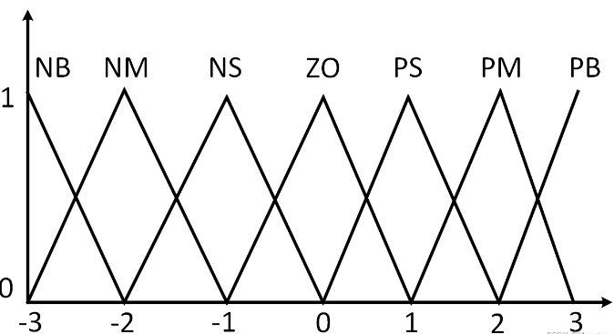
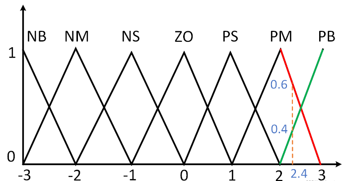
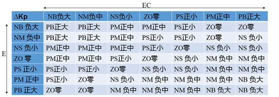
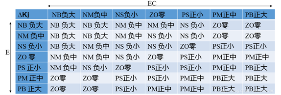
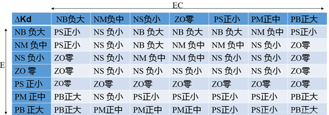
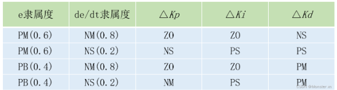

# Engine 6.2.1_模糊PID控制

## 1. 模糊 PID 原理

传统的 PID 控制参数是不变的，对于控制对象特性变化时可能出现参数不合适的现象。在现实控制中，被控系统并非是线性时不变的，往往需要动态调整 PID 的参数，而模糊控制正好能够满足这一需求。

模糊 PID 控制器主要由模糊化，模糊推理以及解模糊三部分组成。

### 模糊化



<font color=LightGreen>1. 论域的确定</font>

论域可以说是一个人为确定的范围，由于输入 $e$， $\frac{de}{dt}$，输出 $K_P$， $K_I$， $K_D$ 的范围各不相同，把输入映射到论域上更好统一处理。确定论域的范围后，需要对论域进行模糊分类，模糊分类即对论域进行划分。

假设论域的范围为 [-3，3]，把论域平均分为 6 等份，即 [-3, -2]，[-2, -1]，[-1, 0]，[0, 1]，[1, 2]，[2, 3]。

接着把每个端点进行等级划分，依次为：-3—>`NB`(负大)， -2—>`NM`(负中)， -1—>`NS`(负小)， 0—>`ZO`(零)， 1—>`PS`(正小)， 2—>`PM`(正中)， 3—>`PB`(正大)。



<font color=LightGreen>2. 隶属度函数的确定</font>

常见的隶属度函数有三角形隶属度函数，梯形隶属度函数，抛物线型隶属度函数。通常使用三角隶属度函数。隶属度函数的值域为 [0, 1]。



> 若输入 $e$ 经过映射后的值为 2.4，那么对应下图红线与绿线的值分别为 0.6，0.4, 这两个就是隶属度，表示该输入属于 `PM` 的概率为 0.6，而属于 `PB` 的概率为 0.4。
>
> 

### 模糊推理

<font color=LightGreen>1. 模糊推理表</font>

- $K_P$ 规则

调节初期应适当取较大的 $K_P$ 值以提高响应速度，而在调节中期，$K_P$ 则取较小值，以使系统具有较小的超调并保证一定的响应速度；而在调节过程后期再将 $K_P$ 值调到较大值来减小静差，提高控制精度。



- $K_I$ 规则

在调节过程的初期，为防止积分饱和，其积分作用应当弱一些，甚至可以取零；而在调节中期，为了避免影响稳定性，其积分作用应该比较适中；最后在过程的后期，则应增强积分作用，以减小调节静差。



- $K_D$ 规则

在调节初期，应加大微分作用，这样可得到较小甚至避免超调；而在中期，由于调节特性对$K_D$ 值的变化比较敏感，因此，$K_D$ 值应适当小一些并应保持固定不变；然后在调节后期，$K_D$ 值应减小，以减小被控过程的制动作用，进而补偿在调节过程初期由于 $K_D$ 值较大所造成的调节过程的时间延长。



<font color=LightGreen>2. 隶属度解算</font>

> 假设此刻的输入 $e$ 为 8，$\frac{de}{dt}$ 为 -12，而 $e$ 的范围为 [-10,10]，$\frac{de}{dt}$ 的范围为[-20,20]。则通过模糊化得到 e 的隶属度为 $0.6(PM)$ 与 $0.4(PB)$，$\frac{de}{dt}$ 的隶属度为$0.8(NM)$ 与 $0.2(NS)$，然后，对 $e$ 与 $\frac{de}{dt}$ 的隶属度进行两两组合，并进行查表，得到下表的关系：
>
> 
>
> 接着，计算各输出 $K_P$, $K_I$, $K_D$ 的隶属度。以 $K_P$ 为例：
> $$
> 0.6(PM) \times 0.8(NM) = 0.48(ZO) \\
> 0.6(PM) \times 0.2(NS) = 0.12(NS) \\
> 0.4(PB) \times 0.8(NM) = 0.32(ZO) \\
> 0.4(PB) \times 0.2(NS) = 0.08(NM)
> $$
> 最后对输出的隶属度进行整合，由上面计算可知，$K_P$ 的隶属度为 $0.8(ZO)$，$0.12(NS)$，$0.08(NM)$。

### 解模糊

常用的解模糊方法有：最大隶属度法，重心法，加权平均法。通常使用重心法解模糊。首先求出 $K_P$， $K_I$， $K_D$  的期望，随后把期望作为在论域的值，在确定输出的范围后，根据区间映射公式，可得出输出值。

### 模糊 PID 代码

```c
int pfuzzy_table[7][7]=
{
{pb, pm, ps, ps, pm, pm, ps},
{pm, ps, zo, zo, ps, ps, ps},
{ps, zo, ns, ns, zo, zo, zo},
{zo, ns, nm, nb, nm, ns, zo},
{zo, zo, zo, ns, ns, zo ,ps},
{ps, ps, ps, zo, zo, ps, pm},
{ps, pm, pm, ps, ps, pm, pb}
};

int ifuzzy_table[7][7]=
{
{nb, nb, nm, nm, ns, zo, zo},
{nb, nb, nm, ns, ns, zo, zo},
{nb, nm, ns, ns, zo, ps, ps},
{nm, nm, ns, zo, ps, pm, pm},
{nm, ns, zo, ps, ps, pm, pb},
{zo, zo, ps, ps, pm, pb, pb},
{zo, zo, ps, pm, pm, pb, pb}
};

int dfuzzy_table[7][7]=
{
{pb, pb, ps, nb, ns, zo, zo},
{pb, pb, ps, nm, zo, ps, ps},
{zo, zo, zo, ns, zo, ps, pm},
{pm, ps, zo, ns, zo, ps, pm},
{pm, ps, zo, ns, zo, zo, zo},
{ps, ps, zo, nm, ps, pb, pb},
{zo, zo, ns, nb, ps, pb, pb}
};

#define abs(x)   x>0 ? x : (-x)
#define limit(x, dowm, up)   x > up ? up : x < dowm ? dowm : x

//初始化函数
void fuzzy_init(fzy_pid_t *ptr, float error_down, float error_up, float errorc_down, float errorc_up, float kp_down, float kp_up, float ki_down, float ki_up, float kd_down, float kd_up, float inter_limit, float out_limit)
{
	ptr->kp = 0;
	ptr->kp_down = kp_down;
	ptr->kp_up = kp_up;
	ptr->kp_step = (kp_up - kp_down)*0.1666667f;
	
	ptr->ki = 0;
	ptr->ki_down = ki_down;
	ptr->ki_up = ki_up;
	ptr->ki_step = (ki_up - ki_down)*0.1666667f;
	
	ptr->kd = 0;
	ptr->kd_down = kd_down;
	ptr->kd_up = kd_up;
	ptr->kd_step = (kd_up - kd_down)*0.1666667f;
	
    ptr->error = 0;
	ptr->last_error = 0;
	ptr->errorc = 0;
	
	ptr->error_down = error_down;
	ptr->error_up = error_up;
	ptr->error_step = (error_up - error_down)*0.1666667f;
	
	ptr->errorc_down = errorc_down;
	ptr->errorc_up = errorc_up;
	ptr->errorc_step = (errorc_up - errorc_down)*0.1666667f;
	
	ptr->ref = 0;
	ptr->fdb = 0;
	
	ptr->iout = 0;
	ptr->out = 0;
	
	ptr->inter_limit = inter_limit;
    ptr->out_limit = out_limit;
}

//解模糊
float exp_fuzzy(int zs, int ys, int zx, int yx, float a, float b)
{
  return (zs * a * b + ys * a * (1.0f-b) + zx * (1.0f-a) * b + yx * (1.0f-a) * (1.0f-b));
}

//模糊化
void fuzzification(fzy_pid_t *ptr,float ec)
{
    int ep = 0;
	int ecp = 0;
	float epf = 0;
	float ecpf = 0;
	epf = limit(ptr->error, ptr->error_down, ptr->error_up) / ptr->error_step;
	ecpf = limit(ec, ptr->errorc_down, ptr->errorc_up) / ptr->errorc_step;
	ep = (int16_t)(epf + 3);
    ecp = (int16_t)(ecpf + 3);
	epf = limit(epf, -3, 3);
	ecpf = limit(ecpf, -3, 3);
	ep = limit(ep, 0, 5);
	ecp = limit(ecp, 0, 5);
	ptr->kp = ptr->kp_up*0.5f + ptr->kp_down*0.5f + ptr->kp_step * exp_fuzzy(pfuzzy_table[ep][ecp], pfuzzy_table[ep][ecp+1], pfuzzy_table[ep+1][ecp], pfuzzy_table[ep+1][ecp+1],1-( epf + 3 - ep), 1-(ecpf + 3 - ecp));
	ptr->ki = ptr->ki_up*0.5f + ptr->ki_down*0.5f + ptr->ki_step * exp_fuzzy(ifuzzy_table[ep][ecp], ifuzzy_table[ep][ecp+1], ifuzzy_table[ep+1][ecp], ifuzzy_table[ep+1][ecp+1], 1-(epf + 3 - ep), 1-(ecpf + 3 - ecp));
	ptr->kd = ptr->kd_up*0.5f + ptr->kd_down*0.5f + ptr->kd_step * exp_fuzzy(dfuzzy_table[ep][ecp], dfuzzy_table[ep][ecp+1], dfuzzy_table[ep+1][ecp], dfuzzy_table[ep+1][ecp+1], 1-(epf + 3 - ep), 1-(ecpf + 3 - ecp));
}

//pid计算
float fuzzypid_cal(fzy_pid_t *ptr, float ec,float ref, float fdb)
{
	ptr->ref = ref;
	ptr->fdb = fdb;
	ptr->last_error = ptr->error;
    ptr->error = ptr->ref - ptr->fdb;
	ptr->errorc = ptr->error - ptr->last_error;
	
	fuzzification(ptr,ec);
	
    ptr->iout += ptr->ki * ptr->error;
	ptr->iout = limit(ptr->iout, -ptr->inter_limit, ptr->inter_limit);
	ptr->out = ptr->kp * ptr->error + ptr->iout + ptr->kd * ptr->errorc;
	return (limit(ptr->out, -ptr->out_limit, ptr->out_limit));
}
```

## 2. 基于模糊 PID 控制的底盘控制方案简介


