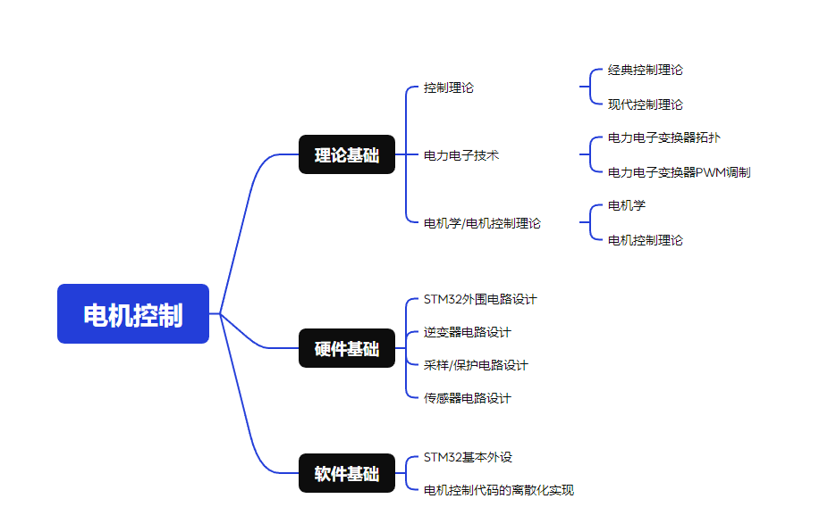

# Engine
电机驱动学习笔记

## 本库的使用方法

本库是电机驱动的笔记合集，适用于学习STM32的基础驱动后进行学习。

底盘运动学迁移至 Robot 仓库内。

V1.0 / V2.0 版本停止更新，V3.0 重新整理了已有的内容。

STM32 基础驱动：[Click Here](https://github.com/SSC202/STM32_Basic)

### 使用此库的前置条件



### 文件夹结构

```
.
|--  BSP    	// 各类电机的单片机驱动库
|--  Code       // 测试例程
|--  Note       // 笔记
|--  Handbook   // 官方手册
|--  Tool		// 调试工具
|--  Mode		// 建模仿真
```


